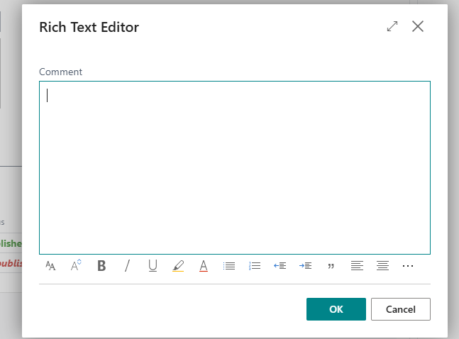

# 🚀 GitHub Integration 

This guide explains how to integrate GitHub with Microsoft Dynamics 365 Business Central.  
You'll learn how to generate a Personal Access Token (PAT), configure Business Central, manage GitHub issues, and sync everything seamlessly.

---

## Overview

Quick intro about GitHub & Business Central integration, focusing on tasks like issue management, syncing, and user token control.

---

## 1. How to Generate a GitHub Personal Access Token

Before using GitHub features in Business Central, you must create a **Personal Access Token (PAT)** to allow Business Central to access your GitHub repositories.

### Step-by-Step Guide

1. **Log in to GitHub**  
   Go to [https://github.com](https://github.com) and sign in.

2. **Go to Developer Settings**  
    - Click your profile picture → **Settings**  
        
    - Scroll down and click **Developer settings**  
      

3. **Create a Token**  
    - Click **Personal access tokens**  
        
    - Select **Tokens (classic)**  
        
    - Click **Generate new token (classic)**  
      

4. **Configure the Token**  
    - **Name**: `Business Central Integration Token`  
    - **Expiration**: 30/90 days or `No expiration`  
        
    - **Repository access**: Set to `All repositories`  
    - **Permissions**:  
        
      - `Contents`: Read and write  
      - `Issues`: Read and write

5. **Generate & Save the Token**  
    - Click **Generate token**  
        
    - **Copy** the token immediately  
        
    > ⚠️ Once you leave the page, the token cannot be retrieved again.

---

## 🔎 Where to Find the Repository Owner and Repository Name?

In the image below, you can see where to locate the values required for setting up GitHub integration in Business Central:

- 🟥 The **circled part** indicates the **Repository Owner** – this is your GitHub **username** or **organization name** (e.g., `bojanmasic`).
- 🟥 The **highlighted rectangle** shows the **Repository Name** – the actual GitHub repository name (e.g., `NameForDocumentation`).

💡 These values should be entered in **Business Central** under the **GitHub Setup** section:
- **Repository Owner** = `bojanmasic`
- **Repository Name** = `NameForDocumentation`

They are used along with your **Personal Access Token (PAT)** to allow Business Central to connect and interact with your GitHub repositories.

---

## 2. Setup in Business Central

Now that your GitHub is ready, you can integrate it into **Business Central**.

### Open GitHub Setup Page

- Search for `GitHub Setup` in Business Central  
  

---

### GitHub Setup Page

#### Configuration Section

- **Repository Owner**  
  GitHub username or organization name.  
  Example: `bojanmasic`  
  **_Required_**

- **Repository Name**  
  GitHub repository name.  
  Example: `NameForDocumentation`  
  **_Required_**

---

#### Default GitHub Token Section

- **GitHub Token**  
  Paste the Personal Access Token here.  
  This token will be used for all API calls unless overridden per user.

---

## 3. Assign User-Specific GitHub Tokens (Optional)

The **GitHub Users** page lets you assign individual tokens to specific BC users. These override the default token from the setup page.

- Open `GitHub Users` from the search bar, same as GitHub Setup.
- Click **+ New**  
  

- Fill in:
    - **User Name**: Select a Business Central user from the dropdown  
      
    - **GitHub Token**: Their personal token (created earlier on GitHub)  
      

> Exit the page when you're done

---

## 4. 🗂 GitHub Issues in Business Central

The **GitHub Issues** page in Microsoft Dynamics 365 Business Central helps you manage issues from your connected GitHub repository — all in one place.

---

## 📋 View & Fetch Issues

On this page, you can:

- 🔎 **See all existing issues** from the connected GitHub repository
- 🔄 **Fetch** issues from GitHub using the **`Fetch Issues`** button

If there are any new issues created directly in GitHub (but not yet in Business Central), clicking **`Fetch Issues`** will sync them into the list view.

> ✅ This ensures the issue list in Business Central always stays up-to-date with GitHub.

---

## ➕ Creating a New Issue

To create a new GitHub issue, click the **`+ New`** button:

This action opens the **GitHub Issue Card**, where you can enter all the issue details.

---

## 🗂 GitHub Issue Card

This page is used to create and manage GitHub Issues directly from Business Central.  
It allows you to draft issues, write comments, and sync everything with GitHub.

---

### 🔍 Page Overview

GitHub Issue Page in Business Central is divided into several sections to manage issues efficiently:

---

### 🔹 Issue Details Section

This section contains fields related to the GitHub Issue itself:

- **Title** – Title of the issue you are creating.
- **Description** – A short or detailed explanation of the issue. Clicking the `...` button opens a larger editor for easier input.
- **State** – Shows the current state (e.g., Draft, Open, Closed).
- **Assignee** – The GitHub username assigned to handle the issue.
- **Comments Count** – Automatically updates based on the number of published comments.
- **Issue ID** – A unique identifier assigned once the issue is created and synchronized with GitHub. When you click the three dots (...) next to this field, it opens the corresponding GitHub issue in a new browser tab.
---

### 🔸 Comments Section

Here you can view and manage GitHub Issue Comments.

- **Body** – The actual comment text.
- **Status** – Indicates whether the comment is *Unpublished* (local only) or already published to GitHub.
- **Created At** – Timestamp when the comment was created.

💡 When you click on body a comment row, a rich text editor opens
  

In this editor, you can:

  - **Include images**
  - **Write detailed explanations**

### 🗨️ Comment Details (Preview Panel)
The panel on the right provides a live preview of the selected comment — just like on GitHub.

In this preview you can:

 - View **text** 
 - Display **embedded** images
 - See a **fully rendered** version of the comment 
---

### 🕒 Timestamps Section

Tracks when the issue was created, updated, or closed.

- **Created At / Updated At** – Dates for issue creation and last edit.
- **Closed At / Closed By** – If the issue is closed, these fields indicate when and by whom.

---

### 🚀 Publishing to GitHub

To send your new or updated issue to GitHub, use the **Publish to Git and Sync** button at the top.

This action:

- Publishes the issue with its description, assignee, and state
- Publishes all unpublished comments
- Syncs issue status back from GitHub

nce you've **published an issue** to GitHub using the `Publish to Git and Sync` button, you can manage its **status** directly within Business Central — without switching back to GitHub.

### How to Open/Close an Issue

1. After the issue is synced with GitHub and has a valid **Issue ID**.
    

2. Click:
    - **Close Issue** – to mark it as closed on GitHub.
    - **Open Issue** – to reopen a previously closed issue.

3. After performing either action, click **`Publish to Git and Sync`** again to synchronize the change with GitHub.

### ✅ Example Workflow

1. Create an issue → Click `Publish to Git and Sync`
2. Click `Close Issue`
3. Click `Publish to Git and Sync` again  
   → Status is updated to **Closed** on GitHub automatically.

---

### 📝 Summary

This page is a fully integrated tool for managing GitHub Issues from within Business Central. It allows users to:

- Create new issues
- Track and assign them
- Create comment
- Sync everything with GitHub seamlessly

---

## 5. Test the Integration

After setup, test the integration with one of the following actions:

- ✅ Create and publish a test issue  
- 📝 Add and sync a comment  
- 🔄 Use the “Sync from GitHub” action to verify access  
- ❌ Close or reopen an issue from Business Central

If something fails:

- 🔍 Double-check **Repository Owner** and **Repository Name**
- 🔐 Ensure **PAT has valid permissions**
- 📅 Confirm the token **is not expired**
- ⚙️ Make sure **required scopes** (`repo`, `issues`) are enabled

---

## ⚠️ Notes

- **PATs are sensitive** — do not share or expose them.
- **User tokens override** the default token in GitHub Setup.
- Monitor **token expiration dates** to avoid disruptions.

---

## ✅ Quick Recap

1. **Create** a GitHub Personal Access Token (PAT)  
2. **Configure** GitHub Setup in Business Central  
3. **Assign** per-user tokens in **GitHub Users**  
4. **Test** the connection by publishing and syncing issues and comments  
