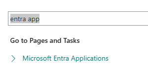
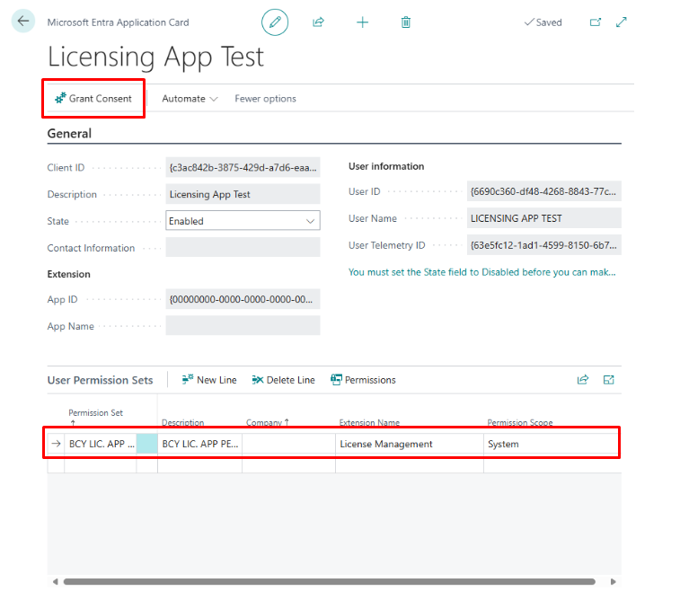

# **Technical License Management**
If you need an example of how to implement our app then you can visit our public repository [here](https://github.com/BCILITY-DOO/AppSource-License-Management-Impl).

## **1. Setup Instructions**
Before you can start calling our web service you need to go to the *Microsoft Entra Applications* page and configure the ***Licensing app***.

**Step 1:** Open the Microsoft Entra Applications page.

**Step 2:** Create a new application entry with the following details:

• **Client ID:** (Enter your client ID)

• **Description:** (Provide a brief description)

• **State:** Set to **Enabled**

After saving, your application page should reflect these changes.

**Step 3:** Go to the *User Permission Sets* and add the ***BCY Lic. App Perms*** permission set to the user.

**Step 4:** Click the *Grant Consent* action at the top of the page.

## **2. Making the HTTP request**

### **2.1 URL address**

Use the following URL format when sending your request in code: 

https://api.businesscentral.dynamics.com/v2.0/ ***{Tenant GUID}*** / ***{Environment Name}*** /ODataV4/LicenseManagement_CheckLicenseData?company= ***{Receiving Company GUID}*** 

Where:

- ***Tenant GUID***: The GUID of the tenant that will receive the HTTP request.
- ***Environment Name***: The name of the environment that will receive the HTTP request.
- ***Receiving Company GUID***: The GUID of the company that will receive the HTTP request.

### **2.2 Request Parameters**
**HTTP Method**: POST 

The only things required to add to the headers is the **Content-Type** to the **Content Headers** specifying *application/json* and the **Authorization** to the **Message Headers** with the value *Bearer %1*, where %1 is your OAuth access token.

### **2.3 Request JSON**

<table border='1'>
    <tbody>
        <tr>
            <td><b>Field</b></td>
            <td><b>Description</b></td>
            <td><b>Data Type</b></td>
        </tr>
        <tr>
            <td>AppGUID</td>
            <td>The GUID of the app</td>
            <td>guid</td>
        </tr>
        <tr>
            <td>AppName</td>
            <td>Name of the app</td>
            <td>string</td>
        </tr>
        <tr>
            <td>AppVersion</td>
            <td>Version of the app</td>
            <td>string</td>
        </tr>
        <tr>
            <td>BCVersion</td>
            <td>Version of Business Central in the current environment</td>
            <td>string</td>
        </tr>
        <tr>
            <td>TenantGUID</td>
            <td>GUID of the tenant</td>
            <td>guid</td>
        </tr>
        <tr>
            <td>TenantName</td>
            <td>Name of the tenant</td>
            <td>string</td>
        </tr>
        <tr>
            <td>Date</td>
            <td>Date of request (e.g., today’s date)</td>
            <td>date</td>
        </tr>
        <tr>
            <td>IsEnvironmentProduction</td>
            <td>Indicates if it's a production environment</td>
            <td>boolean</td>
        </tr>
        <tr>
            <td>EnvironmentName</td>
            <td>Name of the environment</td>
            <td>string</td>
        </tr>
        <tr>
            <td>CustomerName</td>
            <td>Company name</td>
            <td>string</td>
        </tr>
        <tr>
            <td>data</td>
            <td>Field</td>
            <td>Encapsulated JSON object (stringified form of all the above fields)</td>
        </tr>
    </tbody>
</table>

#### **2.3.1 Example of Request JSON**

    "data":"{\"AppGUID\":\"116ffd23-0767-453f-a285-6489e894bf2a\",\"AppName\":\"AppSource-License-Management\",\"BCVersion\":\"26.1.33404.34999\",\"AppVersion\":1,\"TenantGUID\":\"383141b2-4480-449c-9751-a76974dcc2bd\",\"TenantName\":\"bcility.onmicrosoft.com\",\"Date\":\"2025-06-19\",\"IsEnvironmentProduction\":false,\"EnvironmentName\":\"Prod-Copy\",\"CustomerName\":\"BCILITY\"}"

### **2.4 Response JSON**
The Response JSON must be read from the *"value"* field of the response message.

<table border='1'>
    <tbody>
        <tr>
            <td><b>Field</b></td>
            <td><b>Description</b></td>
            <td><b>Data Type</b></td>
        </tr>
        <tr>
            <td>IsLicenseValid</td>
            <td>Whether the license is valid</td>
            <td>boolean</td>
        </tr>
        <tr>
            <td>ValidUntil</td>
            <td>License expiration date (may be omitted if license is perpetual)</td>
            <td>date (optional)</td>
        </tr>
        <tr>
            <td>ContactEmail</td>
            <td>Contact email from the company information</td>
            <td>string</td>
        </tr>
    </tbody>
</table>

#### **2.4.1 Example of Response JSON**

    "@odata.context":"https://api.businesscentral...","value":"{\"IsLicenseValid\":true,\"ContactEmail\":\"office@bcility.com\"}"
