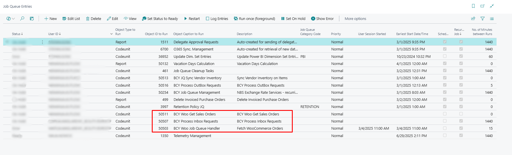

# User Guide for WooCommerce & Business Central Functional Integration

This document provides a detailed overview of the functional integration between WooCommerce, a leading e-commerce platform, and Microsoft Dynamics 365 Business Central, a powerful ERP solution. The integration allows businesses to streamline and automate key operations between their online store and back-office system, reducing manual work and improving data accuracy.

## **1. Publishing and Unpublishing Items to/from WooCommerce**

The **Publish/Unpublish** functionality allows users to control which items from **Microsoft Dynamics 365 Business Central** are made available for sale on the **WooCommerce** online store.

This feature provides flexibility in managing the online product catalog directly from Business Central, without the need to log in to the WooCommerce admin panel.

---

### **1.1 Publishing Items**

To make an item available in WooCommerce:

1. Open the **Item Card** in Business Central.
2. Ensure all required fields (e.g., name, description, price, image, category) are filled.
3. Use the **Publish to WooCommerce** action to push the item to the web store.

Once published, the item is created or updated in WooCommerce with all mapped information, including:
- Item name and description
- Inventory quantity
- Images (if set up)
- Price (based on defined pricing rules)
- Categories and attributes

> If **Auto Sync** is enabled (in WooSetup), publishing can happen automatically upon changes to the item.

---

### **1.2 Unpublishing Items**

To remove an item from the WooCommerce storefront:

1. Open the **Item Card** in Business Central.
2. Disable th **Publish to WooCommerce** option.

This will not delete the product from WooCommerce, but will mark it as **not visible** (status changed to "draft" or "hidden", depending on configuration), preventing it from being ordered by customers.

---

> This functionality is essential for managing what products appear on your WooCommerce store and keeping product data consistent and up to date directly from Business Central.

## **2. Sync items**

The **Sync Items** functionality enables automatic transfer of product data from Dynamics 365 Business Central to your WooCommerce store. It ensures that the items defined in your ERP are visible and available for sale online, without duplicate data entry.

When we publish an item to WooCommerce, and we make some changes, those changes can be manually synced to WooCommerce by using action **Sync Changes to WooCommerce**, on the Item card.

### **2.1 Auto Sync**

The **Auto Sync Settings** section allows you to enable automatic background synchronization of item-related data from Business Central to WooCommerce. When these options are activated, the system will automatically send updates to WooCommerce whenever related changes are made in Business Central—eliminating the need for manual sync actions.

Available options:

- **Auto Sync Item** : Automatically syncs item changes (e.g., name, description, price, inventory) to WooCommerce when the item record is modified in Business Central.

- **Auto Sync Item Categories** : Automatically updates item categories in WooCommerce when categories are created or updated in Business Central.

- **Auto Sync Item Attributes** : Ensures that product attributes (e.g., color, size, material) are synchronized with WooCommerce in real-time whenever they are added or changed.

- **Auto Sync Item Attribute Values** : Sends updates to attribute values (e.g., “Red” for color) to WooCommerce, ensuring consistency between ERP and the web store.

> These settings are especially useful for businesses that frequently update their product catalog and want to maintain real-time accuracy between systems.

> Make sure the WooCommerce API connection is configured and working properly to avoid failed sync attempts.

### **2.2 Manual Sync**

We can also **manually trigger** actions for item sync. Those actions find place in WooCommerce Setup.

- **Auto Publish Items**
  Executes the action which automatically publishes items to WooCommerce.
- **Auto Publish Items Category**
  Executes the action which automatically publishes Item Categories to WooCommerce.
- **Update Picture URLs**
  Executes the action which updates picture URLs for all items.
- **Unpublish Items Exceeding Max Weight**
  Executes the action which unpublish all items which weight is exceeding maximum weight.

## **3. Creating Sales Orders from WooCommerce**

The integration between **WooCommerce** and **Microsoft Dynamics 365 Business Central** enables seamless synchronization of sales orders. When a customer places an order on the WooCommerce store, that order is automatically retrieved and created as a **Sales Order** within Business Central.

This process ensures a fully integrated flow from online sales to back-office operations, eliminating the need for manual entry and reducing the risk of errors.

---

### **3.1 Order Import Process Overview**

Order import from WooCommerce is handled through **WooCommerce Inbox Requests** and is typically executed by scheduled **Job Queue Entries**. However, the process can also be performed manually when needed.

**Steps in the order creation process:**

1. **Fetch/Import Orders**  
   Orders placed in WooCommerce are fetched via the **Fetch WooCommerce Orders** action. This retrieves all new orders and stores them in the **WooCommerce Inbox** within Business Central.

2. **Process Requests**  
   After the orders are imported into the inbox, the **BCY Process Inbox Requests** function processes each request and generates corresponding **Sales Orders** in Business Central.

3. **Sales Order Creation**  
   A fully structured Sales Order is created based on the WooCommerce data, including:
   - Customer information
   - Shipping and billing addresses
   - Ordered items with quantities and prices
   - Shipping methods and notes
   - Payment details
  
---

### **3.2 Automation via Job Queue**

The process is typically automated using **Job Queue Entries** in Business Central:

- `Fetch WooCommerce Orders`
- `BCY Process Inbox Requests`
- `BCY Woo Get Sales Orders`

These jobs are scheduled to run periodically, enabling continuous order syncing between WooCommerce and Business Central without user intervention.

---

### **3.3 Manual Operation (Optional)**

If needed, the entire process can also be run manually:

- Navigate to the **WooCommerce Inbox Requests** page.
- Click **Fetch/Import** to retrieve the latest orders.
- After the orders appear in the inbox, click **Process Request** to convert them into Sales Orders.

This manual workflow is particularly useful during testing phases or when troubleshooting.

---

> **Note:** Orders that cannot be processed due to missing or invalid data will remain in the Inbox with an appropriate status message. You can view logs and take corrective actions before reprocessing.

>  **Best Practice:** Always ensure that item mapping, customer templates, and shipping/payment methods are properly configured to avoid import errors.

## **4. WooCommerce Inbox and Outbox**

The integration between **Business Central** and **WooCommerce** includes two key components for managing and monitoring data exchange:

- **WooCommerce Inbox** – incoming data (requests *from* WooCommerce)
- **WooCommerce Outbox** – outgoing data (requests *to* WooCommerce)

These pages allow users to track the flow of information, review statuses, and resolve any errors that occur during synchronization.

---

### **4.1 WooCommerce Inbox**

The **WooCommerce Inbox** stores data that has been received from the WooCommerce store, such as:

- New orders
- Customer information
- Order updates

Each entry includes detailed information such as:

- Request type (e.g., Sales Order)
- WooCommerce ID and timestamp
- Processing status (e.g., Pending, Processed, Failed)
- Related error messages 

***WooCommerce Inbox – common actions:***

- **Fetch/Import Sales Orders**  
  Retrieves new sales orders from WooCommerce and stores them as incoming requests in the inbox.

- **Import Order by ID**  
  Allows you to manually import a specific order from WooCommerce by entering its unique WooCommerce Order ID. Useful for testing or handling edge cases.

- **Process Request**  
  Processes the selected request(s) and attempts to convert them into **Sales Orders** in Business Central.

- **Show Imported Document**  
  Opens the document (e.g., Sales Order) that was created as a result of a successfully processed request.

- **Show Error Message**  
  Displays error details if the processing failed. Helps in identifying missing data or incorrect mappings.

**How it works:**
- Data is retrieved using **Fetch WooCommerce Orders** (manually or via Job Queue).
- Requests appear in the Inbox and are processed using **BCY Process Inbox Requests**.
- Once processed, they create records (e.g., Sales Orders) in Business Central and are marked as completed.

> Requests with errors will remain in the inbox until corrected and reprocessed.

---

### **4.2 WooCommerce Outbox**

The **WooCommerce Outbox** logs all outgoing data that Business Central sends to WooCommerce, such as:

- Published or updated items
- Category and attribute changes
- Price or inventory updates

WooCommerce Outbox – common actions:

- **Process**  
  Manually sends the selected outbox entry to WooCommerce. Useful for resending failed requests or triggering sync without waiting for the job queue.

- **Delete**  
  Removes the selected outbox entries. This is useful for cleaning up test data or invalid records that you don't want to resend.

- **Show Related Record**  
  Opens the Business Central record (e.g., Item Card) that triggered the sync request. Helps users quickly navigate to the source of the data.

- **Show Error Message**  
  Displays the error description for any failed sync attempt. Helps identify issues such as missing fields, invalid mappings, or connectivity problems.

- **Show Request Message**  
  Shows the full JSON request that was sent to WooCommerce. This is helpful for advanced troubleshooting or verifying the payload.

- **Show Response Message**  
  Displays the response received from WooCommerce after processing the request. Useful for understanding if the sync was successful or if WooCommerce returned a specific error.

Each outbox entry includes:

- Type of operation (Create, Update, Delete)
- Target entity (Item, Category, etc.)
- Result status (Success, Failed)
- Message and WooCommerce response

**How it works:**
- When an item or related data is changed, an outbox entry is generated.
- The system sends data to WooCommerce via API (automatically or manually).
- Status is updated based on the response from WooCommerce.

> You can filter by status to identify failed sync attempts and take corrective actions.

---

### **4.3 Manual & Automated Processing**

- Both Inbox and Outbox can be managed **manually** by the user, or **automatically** via scheduled **Job Queue Entries**.
- Pages provide full transparency into what data is flowing between Business Central and WooCommerce and when.

> **Best Practice:** Regularly monitor the Inbox and Outbox pages, especially after bulk updates or configuration changes.

## **5. WooCommerce Setup (AW)**

The **WooCommerce Setup – AW** page serves as the main configuration center for managing the integration between **WooCommerce** and **Microsoft Dynamics 365 Business Central**. It defines how and when synchronization happens, how entities are mapped, and how orders and items are handled.

This section outlines both the **setup fields** and the **available actions** for functional control.

---

### **5.1 Main Setup Fields**

**Credentials:**

- **Enabled**
  Toggle which enables or disables WooCommerce integration

- **Base URL**  
  URL of your WooCommerce store. This is the base endpoint used for all API communication.

- **Consumer Key**  
  Public key used to authenticate API requests from Business Central to WooCommerce.

- **Consumer Secret**  
  Secret key used together with the Consumer Key to authorize requests securely.

**Wordpress Authentication:**

- **Username**
- **Password**

**Template Settings (sets default settings):**

- **Default Location Code**  
  Determines which inventory location in Business Central will be used for syncing stock quantities with WooCommerce.

- **Skip Creating Woo Customers**
  Toggle button which will skip creating and use default customer if enabled.

- **Default Customer**  
  Specifies the default customer if user not registred on WooCommerce and is a guest.

- **Default Salesperson**  
  Defines the salesperson that will be automatically assigned to imported sales orders.

- **Default POS Unit**
  Defines the default POS Unit

**Additional settings:**

- **Maximum weight**
  Specifies the allowed maximum weight of items published on WooCommerce.

---

###  **5.2 Actions (Ribbon)**

The top action bar includes the following functions:

- **Test API Credentials**
  
  Executes the action which tests if provided API credentials are correct.

- **Auto Publish, Unpublish and Update**
  
  More about this actions in section **[Manual Sync](#22-manual-sync)**.