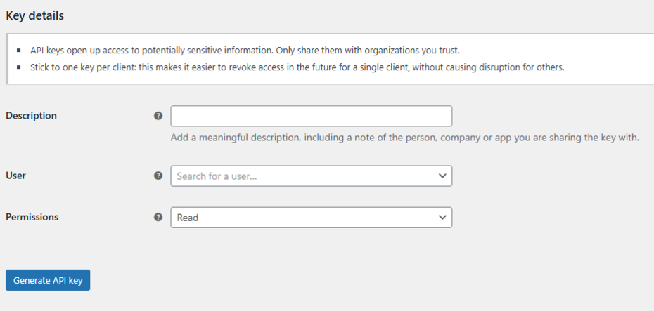
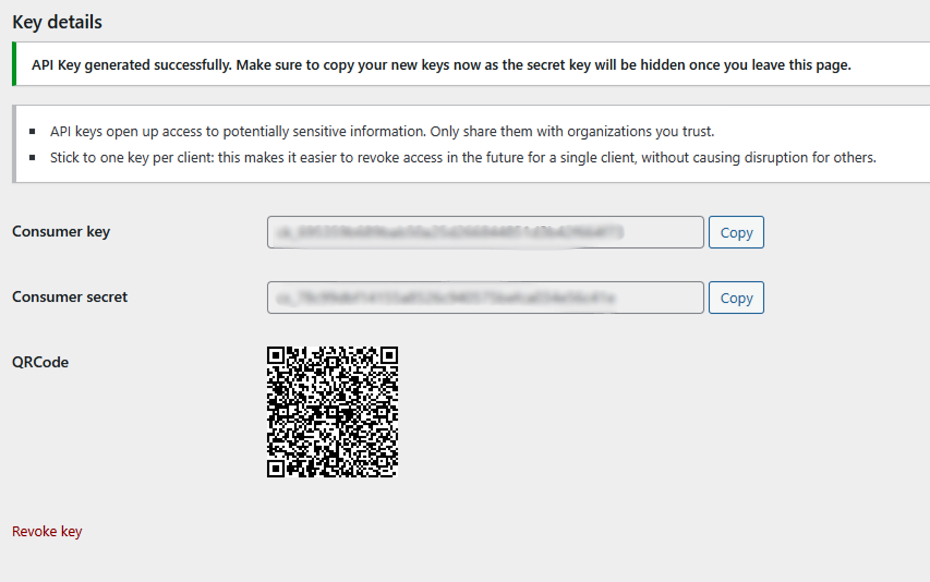
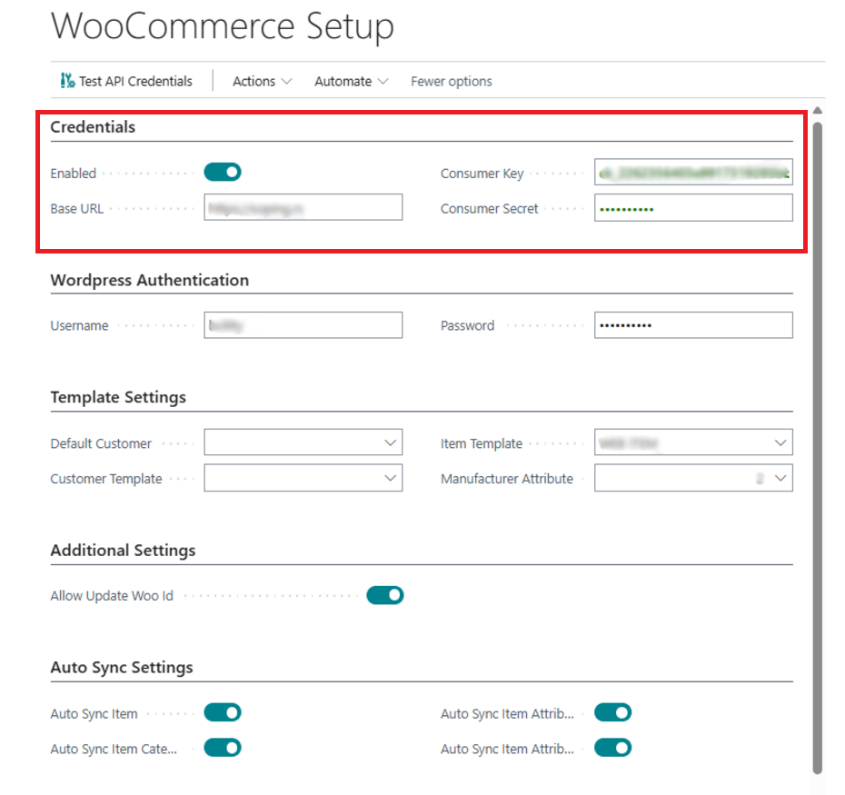
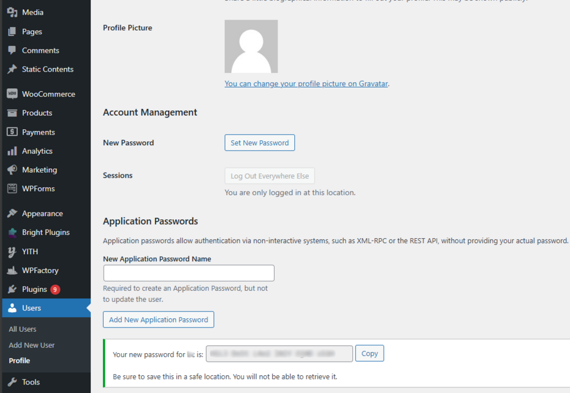
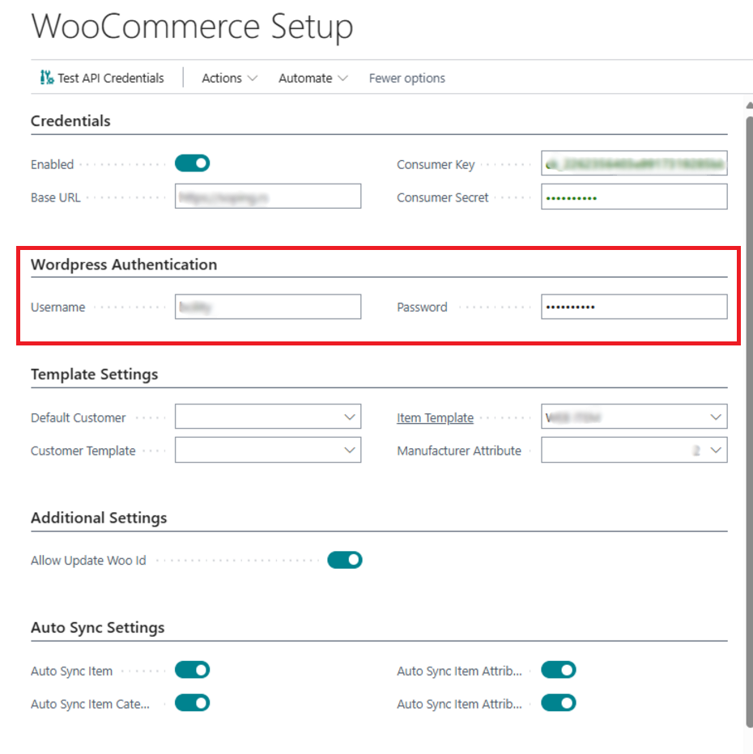

# WooCommerce Setup

WooCommerce Setup allows the connection of the Business Central ERP system with the WooCommerce online store, automatically synchronizing data about products, categories, stocks, and orders. The goal of the setup is to enable seamless data flow between these two systems, reducing the need for manual input and minimizing the risk of errors.

Before starting the WooCommerce integration setup, you need to have:

- An active Business Central environment
- WordPress with WooCommerce installed
- API keys generated in WooCommerce
- Administrator access to both systems

## API Keys in WooCommerce

API keys (**Consumer Key** and **Consumer Secret**) allow secure communication between Business Central and WooCommerce, authenticating requests and enabling data synchronization. They are used to access information about products, orders, and stocks, ensuring automatic updates between the two systems.

### Generating API Keys in WooCommerce

1. In the WordPress admin panel, go to **WooCommerce → Settings → Advanced → REST API**.
2. Click **Add Key**, enter a name, choose the user for whom you want to generate the key, select **Read/Write** permissions, and click **Generate API Key**.
    
3. Save the generated **Consumer Key** and **Consumer Secret**.

    

## 1. Connecting Business Central and WooCommerce
- Enter the API credentials (**Consumer Key** & **Customer Secret**) that enable secure communication between Business Central and WooCommerce.  
- **Base URL** defines the WooCommerce store where synchronization will occur.  
     Example URL: https://YourDomain

This configuration enables the connection of the two systems, eliminates the need for manual data entry in both platforms, and reduces the possibility of errors.  
    

## 2. WordPress Authentication
To create an Application Password, follow these steps:

1. Go to **WordPress Admin → Users → Your Profile**
2. Scroll down to the "Application Passwords" section
3. Enter a name for the new Application Password 
4. Click "Add New Application Password"
   
     

Enter your WordPress administrator username and password to access and update data in the WooCommerce Setup.  
This step ensures controlled access to data and synchronization without the need for manual input.
    

## 3. Managing Woo ID and Additional Options
- **Allow Update Woo ID** – When enabled, this option allows you to manually update this field on item/attribute/category tabs.

This option ensures consistent data mapping between the two systems, preventing synchronization errors.

## 4. Automatic Data Synchronization
- **Auto Sync Item** – Allows automatic product updates between ERP and WooCommerce.
- **Auto Sync Item Category** – Allows automatic synchronization of product categories between ERP and WooCommerce.
- **Auto Sync Item Attribute** – Allows automatic synchronization of additional product attributes such as manufacturer, color, dimensions.
- **Auto Sync Item Attribute Value** – Allows automatic synchronization of attribute values between ERP and WooCommerce.

This ensures that all product and stock data is always up-to-date in the WooCommerce store without the need for manual input.  
When this option is enabled, any changes made to Items, Categories, and Attributes will automatically be reflected on the WooCommerce side.
