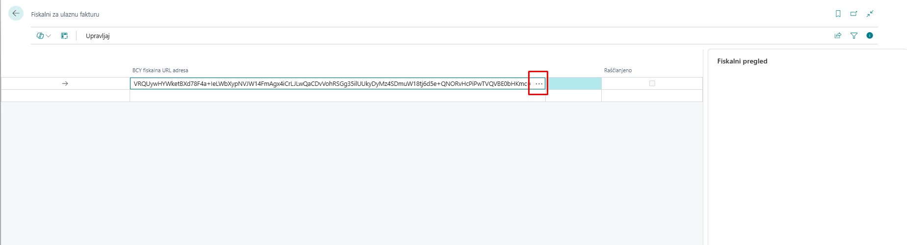
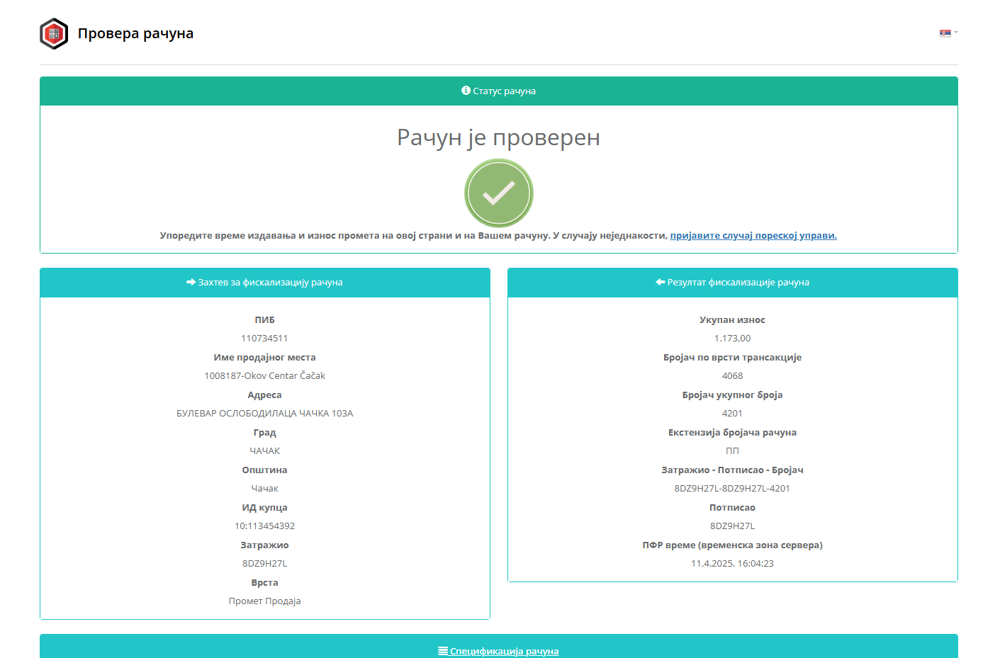
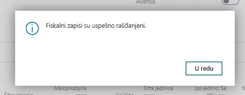
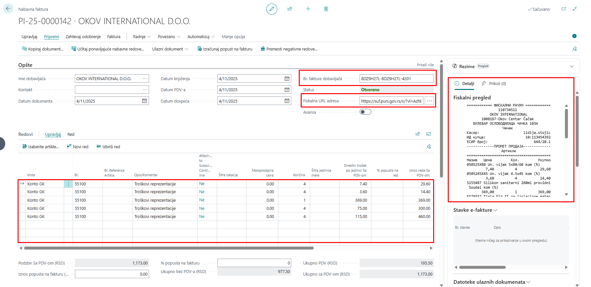
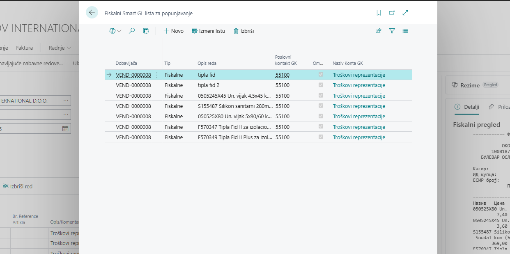
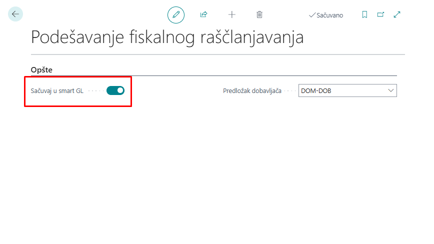
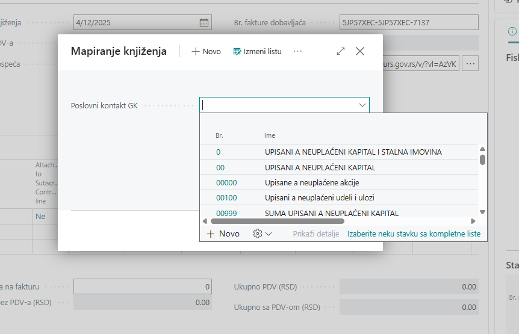
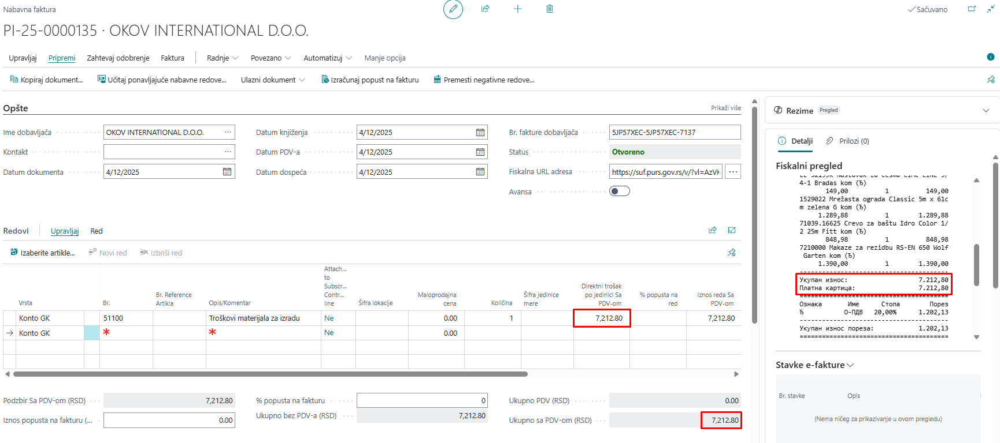
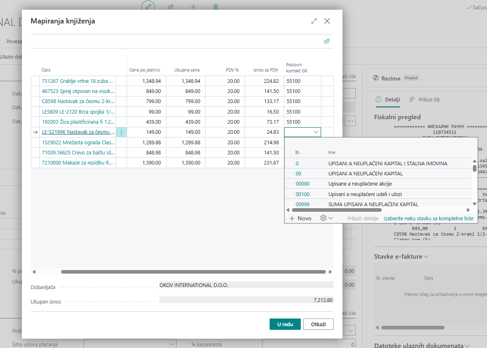
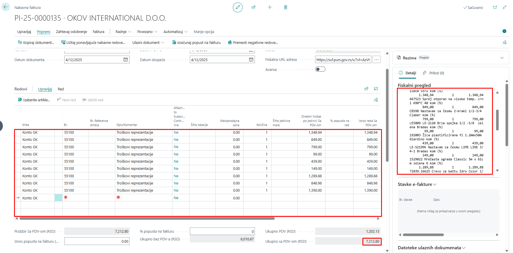

# Fiskalni URL za ulaznu fakturu

## **1. Fiskalni URL**

Na stranici *Fiskalni za ulaznu fakturu* u polje *BCY fiskalna URL adresa* možemo uneti URL fiskalnog računa.

Nakon unosa URL-a možemo odabirom opcije (...) proveriti račun, odnosno otvoriti stranicu na kojoj možemo pronaći informaciju da li je račun validan.

Ukoliko je validan, možemo izaći sa stranice *Fiskalni za ulaznu fakturu* i samim tim ćemo dobiti obaveštenje da je **Ulazna faktura automatski kreirana**. 

## **2. Ulazna faktura**

Kada je ulazna, odnosno nabavna, faktura kreirana, automatski su popunjena polja o podacima dobavljača, kao i polja *Br. fakture dobavljača* i *Fiskalna URL adresa*, a ujedno imamo i *Fiskalni pregled*, odnosno pregled fiskalnog računa.

U sekciji *Redovi* možemo da primetimo da su u ovom slučaju linije automatski popunjene *kontima glavne knjige* na kojima su troškovi koji se nalaze i na fiskalnom računu.

## **3. Pametna memorija**

Da bi se ti troškovi našli na linijama u sekciji redovi, oni moraju postojati na kartici **Fiskalni Smart GL lista za popunjavanje**.

Neophodno je da opcija pametne memorije bude aktivirana, da bi ova funkcija bila omogućena. To možemo uraditi putem kartice **Podešavanje fiskalnog raščlanjavanja**. Neophodno je čekirati opciju ***Sačuvaj u smart GL***.

## **4. Ručna priprema knjiženja**

Postoje slučajevi kada je ulazna/nabavna faktura automatski kreirana bez *Redova*. 

U tim situacijama moguće je ručno upisati troškove sa fiskalnog računa na konta GK putem akcija ***Pripremite jedan red knjiženja*** i ***Pripremite više redova knjiženja***.

- ***Pripremite jedan red knjiženja*** - se koristi kada želimo da ceo fiskalni račun ide na jedan konto,
- ***Pripremite više redova knjiženja*** - se koristi kada želimo da svaka linija ide na zaseban konto.

Primer za ***jedan red knjiženja***:

Prilikom odabira akcije *Pripremite jedan red knjiženja* otvaramo karticu *mapiranje knjiženja* gde biramo konto GK na koji knjižimo ceo trošak.

Nakon odabira potvrđujemo izbor i dobićemo sledeći rezultat:

Primer za ***više redova knjiženja***:

Prilikom odabira akcije *Pripremite više redova knjiženja* otvaramo  karticu *mapiranje knjiženja*, gde će nam biti prikazane sve stavke sa fiskalnog računa pojedinačno. Za svaku od njih moramo upisati vrednost polja *Poslovni kontakt GK* odnosno *konto GK*.

Nakon potvrđivanja dobijamo sledeći rezultat:

