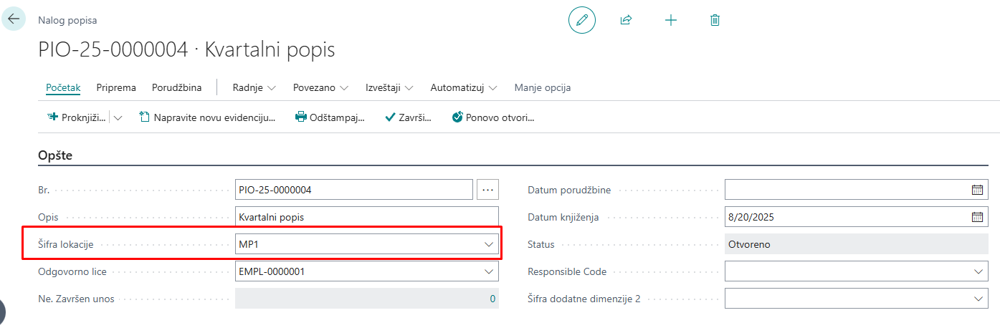
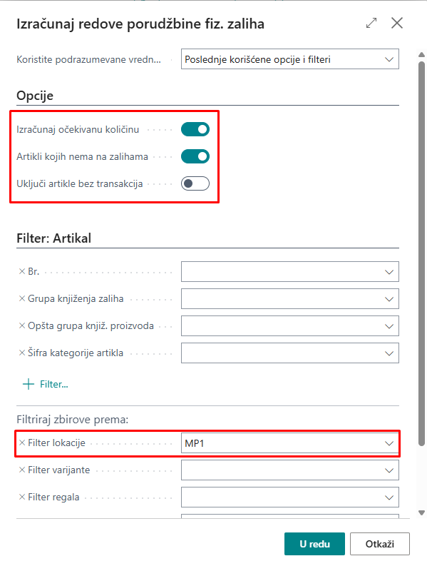
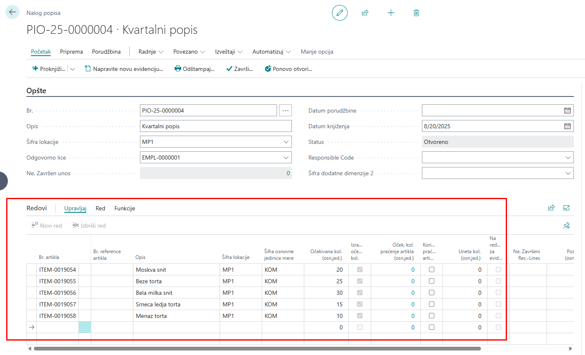
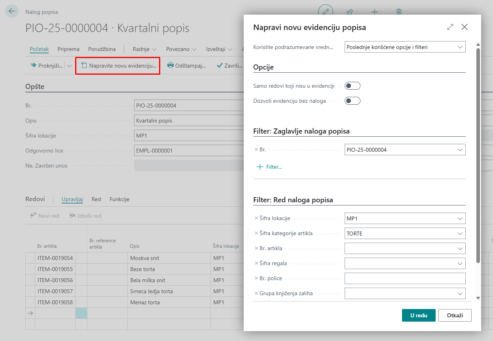
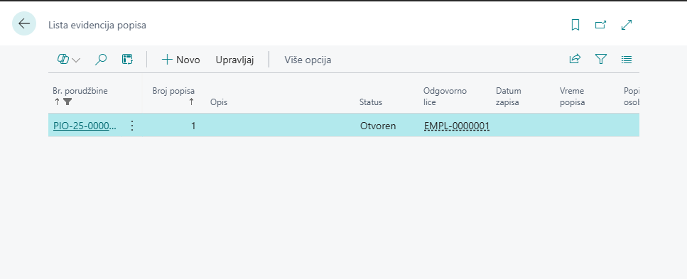
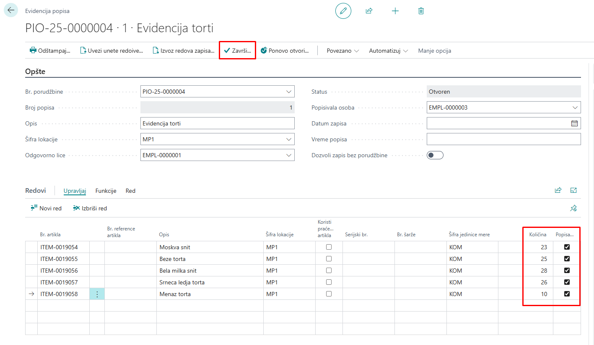
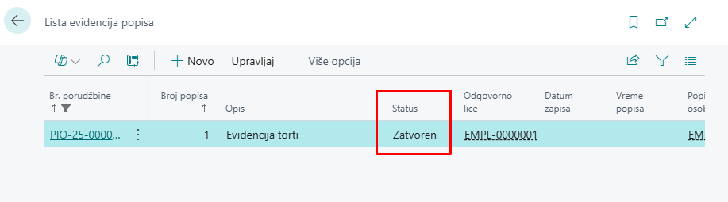
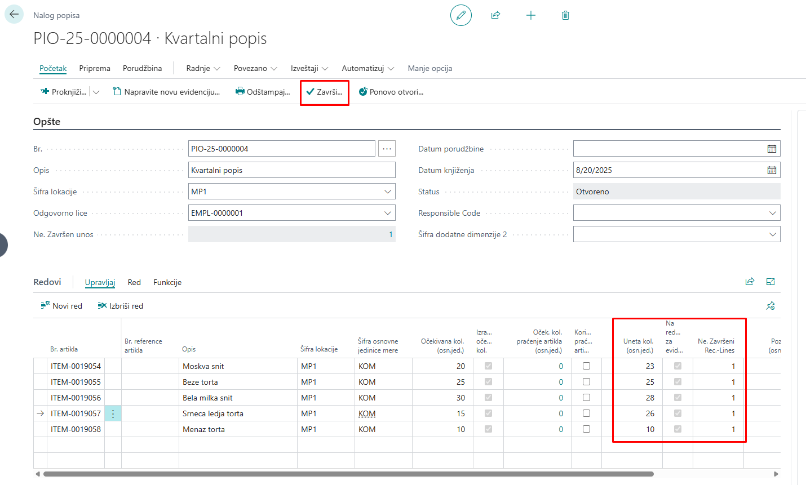
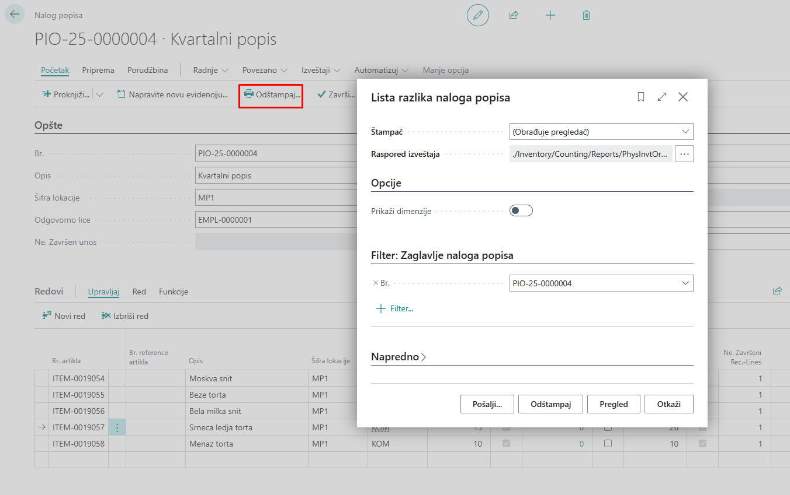

# Popis inventara

Nalozi popisa fizičkog inventara predstavljaju unapređeni pristup popisu zaliha. Za razliku od starijih metoda, ova opcija omogućava da se veliki popis podeli na manje, preglednije zadatke koji se lakše obrađuju.

Popis možemo da radimo po lokaciji, pojedinačnim artiklima, ili po pozicijama u skladištu.

## **1. Kreiranje naloga popisa fizičkog inventara**

Pretraživanjem *Nalozi popisa* otvaramo karticu na kojoj da bismo dodali novi nalog, odaberemo opciju *Novo*. Na kartici popunjavamo osnovne podatke kao što je broj naloga, ukoliko se ne dodeljuje automatski, zatim *Opis*, *Šifra lokacije* na kojoj radimo popis i *Odgovorno lice*.

Odabirom akcije Radnje -> Funkcije -> ***Izračunaj redove*** sistem popunjava očekivane količine za artikle koji su prethodno bili ili nisu bili u prometu.

Otvoriće nam se prozor kao na slici, gde možemo da podesimo opcije i filtere koji nam odgovaraju.

Nakon potvrde, automatski će biti popunjeni redovi sa brojem artikala i očekivanom količinom.

Ukoliko želimo da pripremimo nalog par dana ranije, to možemo postići uz pomoć opcije ***Izračunaj očekivanu količinu***.

## **2. Evidencija popisa**

Iz postojećeg naloga popisa možemo da napravimo evidenciju popisa odabirom akcije ***Napravite novu evidenciju popisa***. Na ovaj način možemo da podelimo jedan veći nalog popisa na više manjih celina i dodelimo ih različitim zaposlenima. Možemo ih podeliti po kategorijama proizvoda, lokacijama u skladištu, vrstama artikala...

Sve evidencije popisa možemo naći pretragom *Lista evidencije popisa*, a takođe ih možemo kreirati sa te stranice klikom na opciju *Novo*.

Na kartici evidencije popisa treba uneti količine koje su izbrojane, ako koristimo serijske brojeve, unosimo ih direktno po linijama, ako pronađemo artikal koji nije na listi, možemo ga ručno dodati i upisujemo zaposlenog koji je obavljao popis.

Kada je popis završen, neophodno je odabrati akciju *Završi*.

Nakon što smo zatvorili evidenciju, status se promenio u *Zatvoreno*.

Zatim se vraćamo na karticu naloga popisa, gde će nam biti popunjene linije unetim količinama putem evidencije popisa. Nakon što su sve količine unete, možemo da zatvorimo nalog popisa putem akcije ***Završi***.

## **3. Razlika naloga popisa**

Do **Liste razlike naloga popisa** možemo doći putem zatvorene kartice naloga popisa ili pretragom **Lista razlika naloga popisa**.

Nakon što smo završili nalog popisa, možemo da štampamo izveštaj popisa direktno sa kartice naloga. Na izveštaju možemo da uočimo pozitivne i negativne količine i iznose.

Pretragom **Lista razlika naloga popisa** otvara se prozor na kome u filter Br. treba da upišemo, odnosno izaberemo sa liste, broj naloga popisa. Nakon toga možemo da pregledamo, šaljemo ili štampamo izveštaj.

