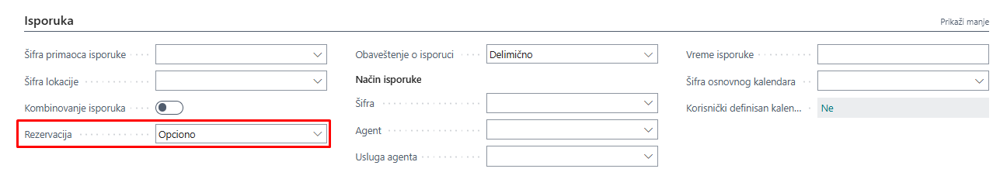
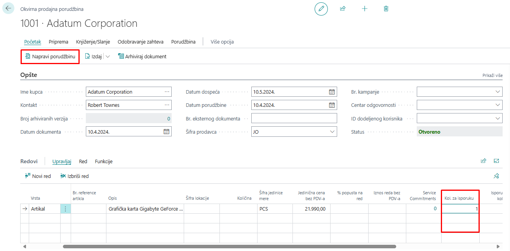
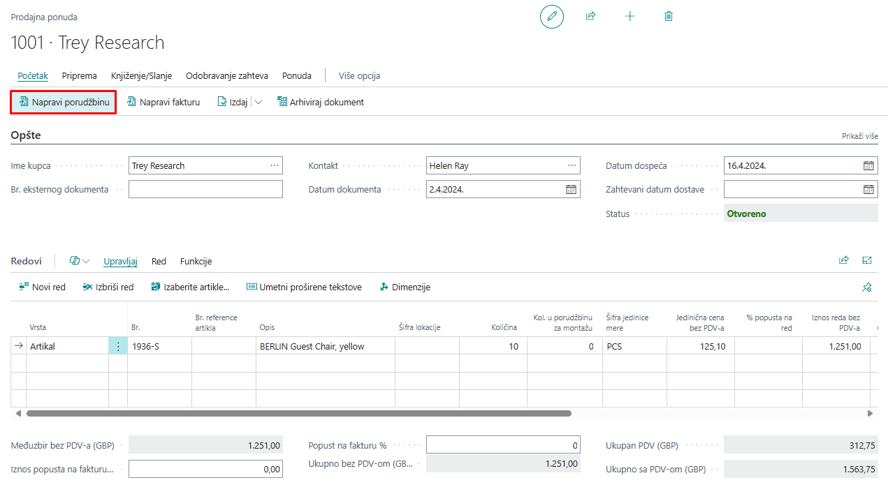
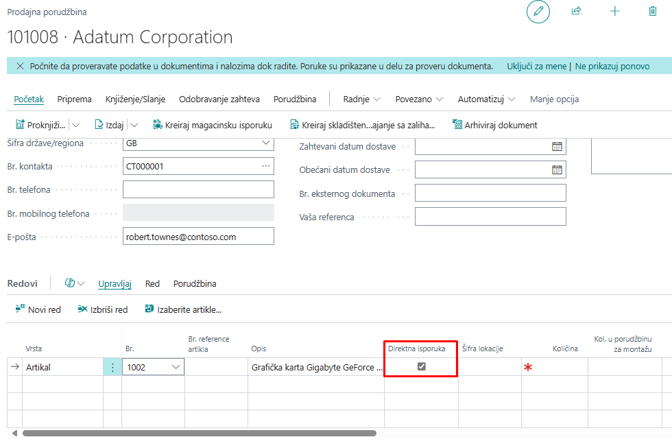
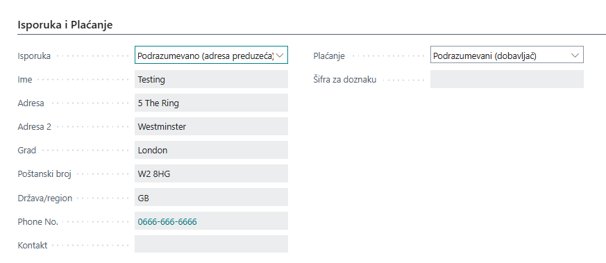
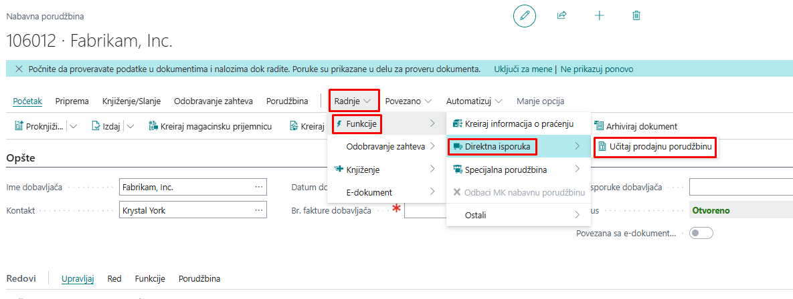

# Modul prodaje

Modul prodaje u programu Microsoft Dynamics 365 Business Central omogućava praćenje celokupnog procesa prodaje robe kupcima. Ovaj modul obuhvata upravljanje informacijama o artiklima, kupcima, kontaktima i različitim prodajnim dokumentima, uključujući prodajne ponude, naloge za prodaju, izlazne fakture i odobrenja.

Pored osnovnih funkcionalnosti, modul omogućava i praćenje prodajnih naloga, analiza prodaje i izveštaja, čime se obezbeđuje potpuna kontrola nad procesom prodaje. Da bi sistem ispravno pratio sve relevantne informacije, neophodno je unapred definisati odgovarajuće postavke, uključujući konfiguraciju kupaca, uslove prodaje, načine plaćanja i pravila knjiženja.

## **1. Podešavanje prodaje i potraživanje**

Na kartici **Postavka prodaje i potraživanja** nalaze se ključne postavke potrebne za ispravno funkcionisanje procesa prodaje u programu **Microsoft Dynamics 365 Business Central**. Ova kartica, slično karticama **artikla, kupca i dobavljača**, organizovana je u više **brzih kartica** koje grupišu srodne postavke radi lakšeg pregleda i podešavanja.

**Brze kartice i njihove funkcije**  

Brze kartice sadrže postavke koje utiču na različite aspekte prodaje, uključujući:

- **Opšte postavke** – osnovni parametri prodaje i potraživanja  
- **Plaćanja i uslovi prodaje** – definisanje načina i rokova plaćanja  
- **Knjiženje i računi** – pravila knjiženja i povezivanje s finansijskim kontima  
- **Odobrenja i limiti kredita** – kontrola dugovanja kupaca i proces odobravanja prodajnih dokumenata  

Ove postavke omogućavaju precizno prilagođavanje sistema poslovnim potrebama, osiguravajući tačnost i doslednost u prodajnim transakcijama.

Brze kartice i polja na Podešavanju prodaje i potraživanja detaljnije su opisane u nastavku.

***Opšte***

Na brzoj kartici "Opšte" mogu se postaviti sledeća polja:

  - **Knjiženje popusta** – određuje vrstu popusta nabavke za zasebno knjiženje:
  - **Bez popusta**: popusti se neće zasebno knjižiti, oduzeće se pre knjiženja (na računskom planu se neće videti iznos popusta).
  - **Popust na fakturu**: istovremeno će se knjižiti popust na fakturu i iznos fakture (na računskom planu će se videti iznos popusta).
  - **Popust na red**: istovremeno će se knjižiti popust na red i iznos fakture (na računskom planu će se videti iznos popusta).
  - **Svi popusti**: istovremeno će se knjižiti popusti na red i fakturu, kao i iznos fakture (na računskom planu će se videti oba iznosa popusta).

  - **Upozorenje o kreditnom limitu** – određuje da li će biti upozorenje o statusu kupca prilikom izrade prodajnog naloga ili fakture:
  - **Kreditni limit**
  - **Dospeli saldo**
  - **Oba upozorenja**
  - **Bez upozorenja**

- **Otpremnica uz fakturu (DA/NE)** – određuje da li se knjiženjem fakture automatski kreiraju proknjižena otpremnica i proknjižena faktura.

- **Zaokruživanje iznosa fakture (DA/NE)** – određuje da li se iznosi zaokružuju za izlazne fakture.

- **Kopiraj ime kupca u stavke (DA/NE)** – određuje da li će ime kupca sa kartice biti kopirano prilikom knjiženja na stavke analitike kupaca.

- **Obavezan broj spoljnog dokumenta (DA/NE)** – određuje da li je obavezno uneti broj spoljnog dokumenta na zaglavlju prodaje.

- **Zatvaranje valuta** – određuje u kojoj meri je dopušteno zatvaranje uplata kupca u različitim valutama:
  - **Nema** – sve stavke uključene u zatvaranje moraju biti u istoj valuti.
  - **EMU** – mogu se zatvoriti stavke u eurima, kao i u nekim od starih nacionalnih valuta (za države u kojima je euro).
  - **Sve** – mogu se međusobno zatvarati stavke u različitim valutama.

- **Obavezni tačni troškovi provračaja (DA/NE)** – označava da se povratna transakcija ne može knjižiti osim ako polje Izvorna stavka artikla za zatvaranje na redu prodajne porudžbine sadrži stavku.

- **Provera akontacije/avansa kod knjiženja (DA/NE)** – označava da se ne može otpremiti ili fakturisati nalog koji ima neplaćeni iznos avansa.

- **Podrazumevani datum knjiženja** – određuje kako se koristi Datum knjiženja na prodajnim dokumentima:
  - **Datum obrade** – u polju Datum knjiženja biće zadat Datum obrade.
  - **Nema datuma** – polje Datum knjiženja biće prazno i biće ručno uneseno pre knjiženja.

- **Podrazumevana količina za otpremu** – označava zadatu vrednost koja je unesena u polje Količina za otpremu u redu naloga za prodaju.

- **Kopiraj opis reda u stavke GK** – određuje da li će se kopirati opis sa redova dokumenta vrste Račun GK na stavke GK.

***Dimenzije***

Na brzoj kartici "Dimenzije" moguće je definisati dimenzije koje će se koristiti za grupe kupaca i za prodavce u izveštajima analize prodaje.

***Brojčane serije***

Na brzoj kartici "Brojčane serije" moguće je postaviti brojčane serije koje će se koristiti za matične podatke i dokumente unutar modula prodaje.

***Pozadina knjiženja***

Ako poslovni procesi zahtevaju pozadinsko knjiženje, na ovoj brzoj kartici može se postaviti za prodajne dokumente.

***Arhiviranje***

Na brzoj kartici "Arhiviranje" moguće je postaviti koji prodajni dokumenti će se arhivirati.

## **2. Rezervacija artikla**

### **2.1 Alokacija zaliha i rezervacija artikla**

Kada je nabavka artikla ograničena, potrebno je alocirati postojeću ili buduću zalihu za određeni red naloga za prodaju. Alokacijom artikla moguće je sprečiti upotrebu zaliha u druge svrhe i osigurati da se porudžbina kupca može otpremiti na planirani datum otpreme.

U programu **Microsoft Dynamics 365 Business Central**, ova se alokacija vrši kroz **rezervacije artikla**. Od svih vrsta prodaje na redovima prodaje, moguće je rezervisati samo artikle.

Opcija rezervacije artikla zavisi pre svega od podešavanja u polju **Rezerviši** na kartici artikla (brza kartica "Planiranje") i na kartici kupca, gde je moguće odrediti pravila na osnovu artikla ili određenog kupca.

Postavka na kartici artikla:

Postavka na kartici kupca:

### **2.2 Opcije u polju "Rezerviši"**

Opcije koje je moguće odabrati u polju **Rezerviši** su:

- **Nikad**: artikal se ne može rezervisati.
- **Po izboru**: sistem ne rezerviše stavku automatski, ali se može rezervisati ručno.
- **Uvek**: artikal se uvek rezerviše.

U procesu prodaje moguće je rezervisati artikle za naloge za prodaju, ali ih je moguće rezervisati i u **Nabavnim porudžbinama**, **servisnim nalozima**, **nalogima za montažu** i **radnim nalozima**.

Moguće je rezervisati artikle na zalihama ili očekivane ulazne artikle na otvorenim redovima dokumenata ili naloga. 

Za rezervaciju artikala potrebno je otvoriti stranicu **Rezervacija**. To se može uraditi s prodajne porudžbine na sledeći način:

1. Kliknite na **Red**.
2. Zatim odaberite **Funkcije**.
3. Izaberite **Rezerviši**.

Svaki red na stranici *Rezervacija* prikazuje podatke o jednoj vrsti reda (prodaja, nabavka, naloga) ili stavke artikla. Redovi opisuju koliko artikala je dostupno za rezervisanje za svaku vrstu reda ili stavke. Stranica *Rezervacija* omogućuje rezervaciju, izmenu ili otkazivanje rezervacije. 

Prikaz stranice *Rezervacija*: 

## **3. Proces prodaje**

Dokumenti za evidenciju prodajnih transakcija u Dynamics 365 Business Central

U programu **Microsoft Dynamics 365 Business Central** u modulu prodaje koriste se sledeći dokumenti za evidentiranje prodajnih transakcija:

- **Prodajna ponuda**
- **Okvirna prodajna porudžbina**
- **Prodajna porudžbina**
- **Izlazna faktura**
- **Proknjižena izlazna faktura**
- **Proknjižena isporuka**
- **Izlazno odobrenje**
- **Nalog za povrat prodatog**
- **Proknjiženo izlazno odobrenje**
- **Proknjižena prijemnica povrata**

### **3.1 Proces prodaje u Dynamics 365 Business Central**

Proces prodaje može početi od **prodajne ponude** ili **okvirne prodajne porudžbine**, koje se mogu pretvoriti u **Prodajnu porudžbinu**.

1. **Knjiženje isporuke** na prodajnoj porudžbini rezultira **proknjiženom isporukom**, čime se smanjuje količina artikla na zalihi.
2. **Knjiženje fakture** stvara **proknjiženu izlaznu fakturu**, koja ažurira podatke na kartici kupca, ažurira artikle i ažurira račun GK.
3. **Knjiženje uplate kupca** ažurira karticu kupca i račun GK.

Na redove dokumenata prodaje u sistemu, u polje **Vrsta**, mogu se odabrati sledeći entiteti za koje se knjiži prodaja:

- **Artikal** – standardni artikli poput robe, sirovina, gotovih proizvoda ili usluga poput konsultacija.
- **Resurs** – osoba ili mašina.
- **Osnovna sredstva** – za prodaju osnovnih sredstava i sitnog inventara.
- **Trošak (artikal)** – dodatni troškovi u prodajnom procesu radi ispravnog vrednovanja zaliha, poput troška prevoza.
- **Račun GK** – za knjiženje svih drugih nerazvrstanih ishoda.

Iako je moguće odabrati pet vrsta prodaje, najčešće se koriste **artikli** i **resursi**.

U nastavku su detaljnije pojašnjeni dokumenti u prodaji.

### **3.2 Okvirna prodajna porudžbina**

**Okvirna prodajna porudžbina** je dokument koji ne utiče na proračun raspoloživosti artikala. Često se koristi u svrhu **ugovora**, gde se sa kupcem dogovore određeni artikli i količina, a potom se, zavisno od uslova, vrši isporuka tih artikala.

Kada iz okvirnog naloga za prodaju kreiramo nalog za prodaju, potrebno je u polje Kol. za isporuku uneti podatak za koju količinu želite kreirati dokument (u ovom primer 1 komada), što se radi na alatnoj traci Početak -> Napravi porudžbinu.

Kreirana prodajna porudžbina se dalje po redovnoj proceduri isporučuje i fakturiše. Nakon završenog knjiženja na okvirnoj prodajnoj porudžbini se u polju *Isporučena količina* može videti informacija o tome koliko je već isporučeno i preostalo: 

### **3.3 Prodajna ponuda** 

Osim **okvirne prodajne porudžbine**, moguće je kreirati **prodajnu ponudu** kao informativni dokument kupcu koji je zainteresovan za određene artikle.

U redove prodajne ponude upisuju se:

- Artikli
- Osnovna sredstva
- Računi GK
- Resursi
- Troškovi artikla

Za odabranu vrstu u redu moguće je uneti dodatne podatke, kao što su:

- Količina
- Šifra lokacije s koje će se knjižiti otprema
- Jedinica mere
- Jedinični trošak
- Popust na red, itd.

Ako kupac pristane na prodajnu ponudu i uslove koji su na njoj, a koji se još uvek mogu promeniti, dokument se prebacuje iz ponude u nalog klikom na akciju **Napravi porudžbinu**. Celi dokument se zatim prebacuje u **Prodajnu porudžbinu**, koja se potom može knjižiti.

### **3.4 Prodajna porudžbina**

Kao i prethodna dva dokumenta, **prodajna porudžbina** se sastoji od **zaglavlja** i **redova**, gde je zaglavlje podeljeno na više brzih kartica unutar kojih su polja relevantna za svaku karticu. Na brzoj kartici moguće je prikazati više polja klikom na **Prikaži više** i po potrebi popuniti podatke u tim poljima.

Ako je proces započet iz prodajne ponude i ista prebačena u naloge za prodaju, potrebno je proveriti da li su svi podaci ispravni ili je potrebno nešto promeniti (npr. način plaćanja, uslov plaćanja itd.). U redovima se može promeniti količina ili, ako želimo delimičnu isporuku, možemo promeniti polje **Kol. za isporuku** ili **Kol. za fakturisanje** ako se radi o fakturisanju.

**Nalog za prodaju** je moguće knjižiti jednom od tri ponuđene opcije, klikom na akciju **Proknjiži** (ili **Proknjiži i ispiši**), a zatim se pojavljuje prozor sa sledećim opcijama:

- **Isporuči** – knjiži se samo isporuka artikla i to one količine definisane u polju **Kol. za isporuku**. Odabirom ove opcije na redovima se ažuriraju vrednosti u poljima **Kol. za isporuku** i **Isporučena količina**.
  
- **Fakturiši** – knjiži se samo fakturisanje i to one količine definisane u polju **Kol. za fakturisanje**. Odabirom ove opcije na redovima se ažuriraju vrednosti u poljima **Kol. za fakturisanje** i **Fakturisana količina**. Nije moguće fakturisati veću količinu od one definisane u polju **Isporučena količina** i već fakturisane količine.
  
- **Isporuči i fakturiši** – knjiži se i isporuka i fakturisanje. Odabirom ove opcije na redovima se ažuriraju vrednosti u poljima **Kol. za isporuku**, **Isporučena količina**, **Kol. za fakturisanje** i **Fakturisana količina**.

Knjiženjem **otpreme** nastaje dokument **Proknjižena isporuka**, dok knjiženjem **fakturisanja** nastaje dokument **Proknjižena izlazna faktura**, o čemu ćemo detaljnije govoriti u nastavku. 

Takođe, knjiženjem isporuka nastale su **stavke analitike artikla** i **stavke vrednosti**. Knjiženjem fakturisanja ažurira se stavka analitike artikla i nastaje nova stavka vrednosti sa stvarnim troškom. Isto tako, nastale su **stavke GK**, **stavka PDV-a**, i **stavke analitike kupaca**.

Ako je knjiženjem isporuke i fakturisana celokupna količina sa prodajne porudžbine, isti dokument se smatra **završenim**. Sistem automatski briše dokument i arhivira ga ako je uključena opcija arhiviranja.

#### **3.4.1 Direktna isporuka**

Jedna od dodatnih mogućnosti knjiženja isporuke u sistemu je **Direktna isporuka**, gde se zapravo porudžbinom kupca kreira porudžbina od dobavljača. Taj isti dobavljač zatim isporučuje robu direktno kupcu.

Nakon što se kreira **prodajna porudžbina** i unesu artikli, potrebno je artiklu za koji se vrši direktna isporuka označiti polje **Direktna isporuka = DA**.

Nakon toga se kreira *Nabavna porudžbina* te osim popunjavanja standardnih polja na zaglavlju (redove ne popunjavamo), potrebno je sledeće:  
Na brzoj kartici *Isporuka i Plaćanje*, u polju *Isporuka* odabrati vrednost *Adresa kupca*, čime se prikazuje polje *Kupac* i u kojem je potrebno odabrati kupca za kojeg se radi isporuka. U ovom slučaju se radi o preduzeću kao kupcu.

Ako kupac ima definisanu **šifru za isporuku**, ona se može izabrati u polju **Šifra primaoca isporuke**. Ovaj podatak se takođe može uneti direktno na **porudžbinu**. 

Ako šifra primaoca nije definisana, koristiće se adresa koja je postavljena na **kartici kupca**.

Nakon što se popune šifra kupca i adresa, potrebno je preko **alatne trake** učitati **prodajnu porudžbinu** za koju se vrši **direktna isporuka**.

Klikom na akciju **Učitaj prodajnu porudžbinu** prikazuju se sve otvorene prodajne porudžbine za definisanog kupca. Potrebno je odabrati onu za koju se vrši **direktna isporuka**. 

Ako nije jasno koji je broj porudžbine, preko akcije **Kartica** moguće je otvoriti dokument i proveriti njegove detalje.

Takođe, ako u redovima prodajne porudžbine ne postoji artikal sa označenim poljem **Direktna isporuka = DA**, taj dokument neće moći da se odabere za direktnu isporuku.

Odabirom dokumenta, popunjavaju se redovi na *Nabavnoj porudžbini* i za istu je onda moguće knjižiti prijem, što automatski knjiži i isporuku na *Prodajnoj porudžbini*. *Direktna isporuka* sa porudžbine ne može se istovremeno primiti i fakturisati. 

Fakturisanje se vrši iz Prodajne porudžbine, nakon što je fakturisana u potpunosti ona količina za koju se radila direktna isporuka, tek onda je moguće knjižiti ulaznu fakturu za povezanu porudžbinu.    

### **3.5 Prodajna faktura**  

Prodajna faktura se kreira na gotovo identičan način kao i **Prodajna porudžbina**. Koristi se u sledećim slučajevima:  

- Fakturisanje proknjiženih isporuka  
- Finansijsko knjiženje stavki koristeći **Konto GK** ili **Osnovno sredstvo** u redovima  
- Direktno knjiženje artikala sa izlazne fakture (u tom slučaju ne nastaje proknjižena izlazna otpremnica, osim ako nije drugačije podešeno u **Podešavanju prodaje i potraživanja**)  
- Zbirno fakturisanje, odnosno fakturisanje više isporuka  

***Postupak kreiranja prodajne fakture***  

1. **Kreirati prodajnu fakturu** i popuniti sva potrebna polja na zaglavlju fakture.  
2. **Učitati redove isporuke** klikom na opciju **Učitaj redove isporuke** u alatnoj traci redova.  

Klikom na akciju, otvara se zasebna stranica s listom redova proknjiženih izlaznih otpremnica, gde je moguće odabrati za koji red se želi kreirati faktura.

Ostatak procesa je identičan, gde je potrebno proveriti da li je sve u redu, eventualno promeniti cenu ili popust te knjižiti fakturu. 
Osim što je izlaznu fakturu moguće kreirati na gore prikazan način, fakturu je moguće napraviti i direktno sa *Prodajne porudžbine* tako da se odabere opcija *Fakturiši* ili *Isporuči i fakturiši*, gde će se prema poljima *Kol. za isporuku* i *Kol. za fakturisanje* fakturisati količine. 

### **3.6 Povrati u prodaji** 

Proces povrata u prodaji započinje kreiranjem **Naloga za povrat prodate robe**.  

*Koraci u procesu povrata*:  

1. **Knjiženje zaprimanja povrata**  
   - Nakon što se roba vrati, knjiži se prijem robe putem **Naloga za povrat prodate robe**.  
   - Time nastaje **Proknjižena prijemnica povrata**.  
   - Količina artikla na zalihama se povećava.  

2. **Knjiženje odobrenja**  
   - Nakon obrade povrata, izdaje se **Proknjiženo izlazno odobrenje**.  
   - Ažuriraju se sledeći podaci:  
     - Kartica kupca  
     - Stanje artikla  
     - Račun glavne knjige (GK)  

3. **Knjiženje povrata novca kupcu**  
   - Kada se izvrši povrat novca, sistem ažurira:  
     - Karticu kupca  
     - Račun GK  

#### **3.6.1 Nalog za povraćaj prodatog**

U slučaju da kupac vraća artikle, taj poslovni događaj se registruje kreiranjem i knjiženjem **Prodajnog povraćaja**.  

1. **Kreiranje Naloga za povrat prodate robe**  
   - Dokument se kreira kako bi se evidentirao povrat artikala od kupca.  

2. **Knjiženje Naloga za povrat prodate robe**  
   - Knjiženjem ovog naloga nastaju:  
     - **Proknjiženo izlazno odobrenje**  
     - **Proknjižena prijemnica povrata**  
   - Količina artikala na zalihama se povećava.  

3. **Očuvanje originalnog troška povrata**  
   - Kako bi se osiguralo da se povrat knjiži sa istim troškom, koristi se funkcija:  
     - **Učitaj redove proknjiženog dokumenta za obrtanje**  
   - Ova funkcija omogućava učitavanje originalnih redova iz proknjiženog dokumenta prodaje, čime se osigurava da se vrednosti i troškovi povrata poklapaju sa originalnom prodajom.  

4. **Knjiženje povrata novca kupcu**  
   - Kada se izvrši povrat novca, sistem automatski ažurira:  
     - **Karticu kupca**  
     - **Račun glavne knjige (GK)**  

Ova funkcija kopira redove s jednog ili više proknjiženih dokumenata kupca definisanog na zaglavlju. Klikom na akciju, otvara se prozor s redovima proknjiženih dokumenata one vrste koja se odabere u filteru. Moguće opcije su *Proknjižene otpremnice*, *Proknjižene fakture*, *Proknjižene prijemnice povrata* i *Proknjižena odobrenja*: 

Na taj način, u redovima se popuni polje *Izvorna stavka artikla za zatvaranje*, čime se osigurava ispravan trošak artikla. Nakon toga, knjiži se prijem ili se prima i fakturiše, čime nastane i proknjiženo izlazno odobrenje. 
