# Korisničko uputstvo za funcionalnu integraciju WooCommerce i Business Central

Ovaj dokument pruža detaljan pregled funkcionalne integracije između WooCommerce-a, jedne od vodećih e-commerce platformi, i Microsoft Dynamics 365 Business Central-a, moćnog ERP rešenja. Integracija omogućava preduzećima da pojednostave i automatizuju ključne procese između svoje online prodavnice i poslovnog sistema u pozadini, čime se smanjuje ručni rad i poboljšava tačnost podataka.

## **1. Objavljivanje i uklanjanje artikala sa WooCommerce-a**

Funkcionalnost *objavljivanja/uklanjanja* omogućava korisnicima da kontrolišu koji artikli iz Microsoft Dynamics 365 Business Central sistema će biti dostupni za prodaju na WooCommerce online prodavnici.

Ova funkcija pruža fleksibilnost u upravljanju online katalogom proizvoda direktno iz Business Central-a, bez potrebe za prijavljivanjem u WooCommerce administratorski panel.

---

### **1.1 Objavljivanje artikala**

Da biste učinili artikal dostupnim na WooCommerce-u:

- Otvorite karticu artikla u Business Central-u.
- Proverite da su sva obavezna polja popunjena (npr. naziv, opis, cena, slika, kategorija).
- Koristite akciju **Objavi stavku na WooCommerce** da biste objavili artikal na web prodavnicu.

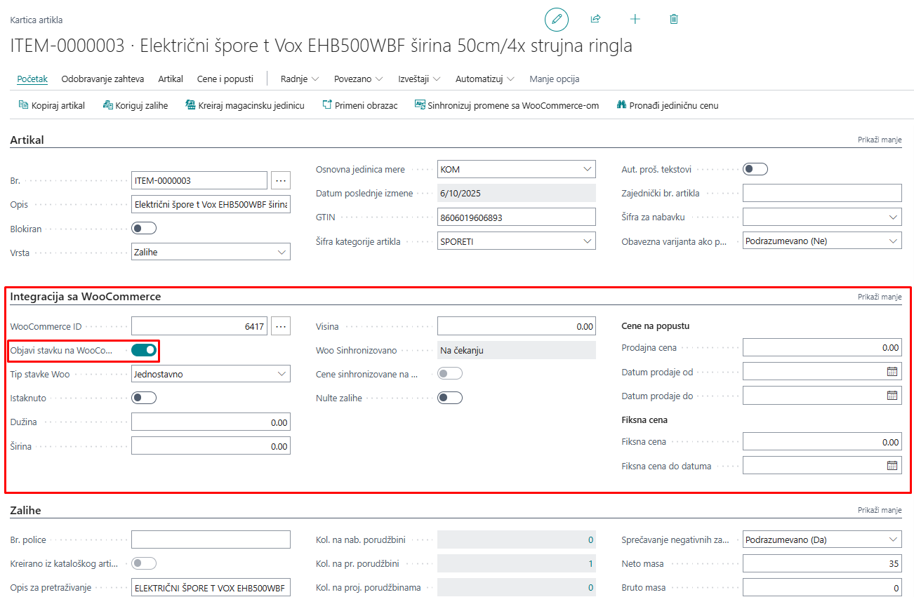

#### **1.1.1 Slike**

Na kartici artikla imamo sekciju **Slika**, gde možemo otvoriti URL-ove slika i rasporediti ih po željenom redosledu, tako da se prilikom objavljivanja artikla na WooCommerce prikazuju slike u željenom redosledu. Pored URL-ova se nalazi i pregled slika.

> Slike moraju biti raspoređene pre objavljivanja artikla na WooCommerce.

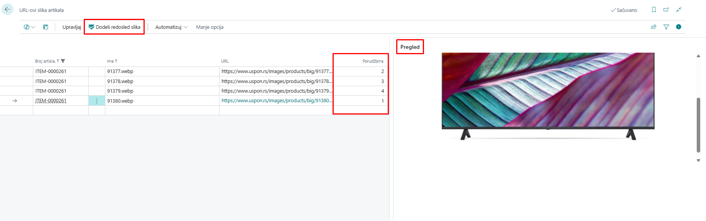

#### **1.1.2 Atributi artikla**  

Na kartici artikla nalazi se sekcija **Atributi artikla**, koja prikazuje specifikacije artikla kao što su proizvođač, snaga, model i drugi relevantni detalji. Ovaj spisak atributa može se prilagođavati i menjati prema vašim potrebama.

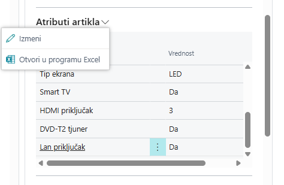

Pored toga, postoji posebna stranica **Atributi artikla** na kojoj se upravlja svim atributima artikala. Na vrhu te stranice nalaze se akcije **Pošalji atribut na WooCommerce** i **Pošalji sve atribute na WooCommerce**, koje omogućavaju sinhronizaciju pojedinačnih ili svih atributa sa WooCommerce prodavnicom.

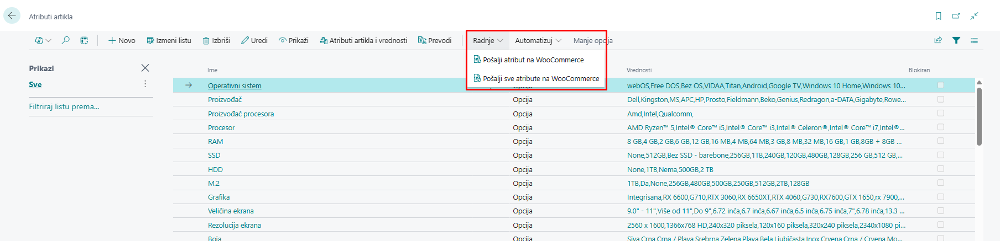

#### **1.1.3 Kategorije artikala**  

Za nesmetanu integraciju između Business Central-a i WooCommerce-a, neophodno je da svaki artikal u Business Central-u bude dodeljen određenoj kategoriji. Pravilna kategorizacija obezbeđuje tačnu sinhronizaciju proizvoda, poboljšava organizaciju i olakšava efikasno upravljanje zalihama i podacima o prodaji na obe platforme.

Kategoriju artikla možemo dodeliti direktno na kartici artikla, birajući je sa liste kategorija artikala prethodno definisanih u sistemu.

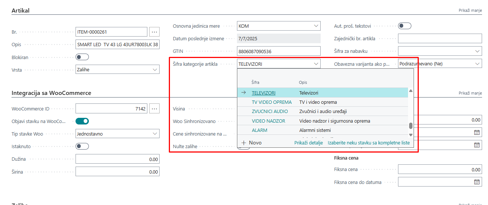

Lista kategorija artikala sastoji se od *roditeljskih* i *podkategorija*, koje možemo ručno poslati na WooCommerce, gde svaka kategorija dobija svoj ID.

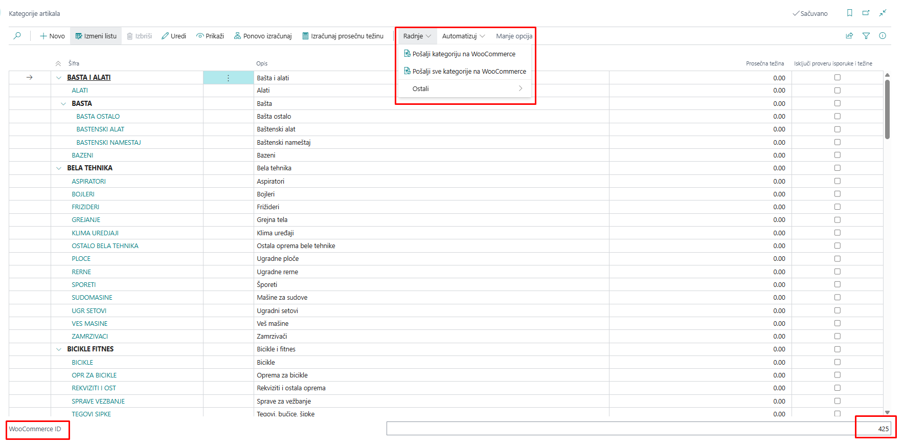

#### **1.1.4 Cene**  

Cene artikala se prvenstveno određuju u Business Central-u i automatski se sinhronizuju sa WooCommerce-om kako bi se obezbedila usklađenost između oba sistema. Sve izmene cena u Business Central-u biće prikazane na WooCommerce prodavnici prilikom sledećeg ciklusa sinhronizacije.

Integracija podržava *standardne prodajne cene*, kao i *specijalne cene*, *popuste* i *promotivne cene* definisane u Business Central-u. Važno je pravilno konfigurisati pravila cena unutar Business Central-a kako bi se izbegli konflikti ili nepravilno prikazivanje cena u WooCommerce prodavnici.

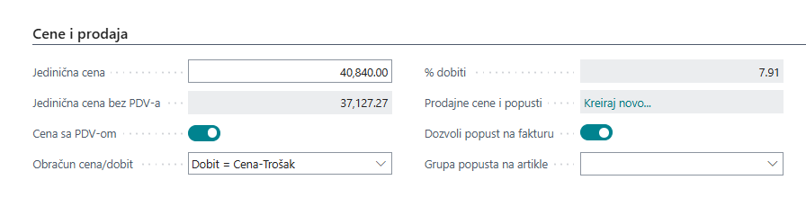

#### **1.1.5 Zalihe**  

Sinhronizacija zaliha između Business Central-a i WooCommerce-a se obavlja putem automatizovanog zadatka (batch job) pod nazivom **Sync Vendor Inventory on Items**. Ovaj zadatak se pokreće u unapred definisanim intervalima, obično zakazanim kroz **Stavke reda čekanja za posao** u Business Central-u, i obezbeđuje da količine zaliha u WooCommerce-u tačno odražavaju stvarni nivo zaliha koje se prate u Business Central-u.

Redovnim pokretanjem ovog zadatka, preduzeća mogu održavati ažurnost dostupnosti zaliha u WooCommerce prodavnici bez potrebe za ručnom intervencijom, čime se smanjuje rizik od prekomerne prodaje ili neslaganja u zalihama. Pravilna konfiguracija rasporeda zadatka je ključna za postizanje željene učestalosti ažuriranja i nesmetano upravljanje zalihama na obe platforme.

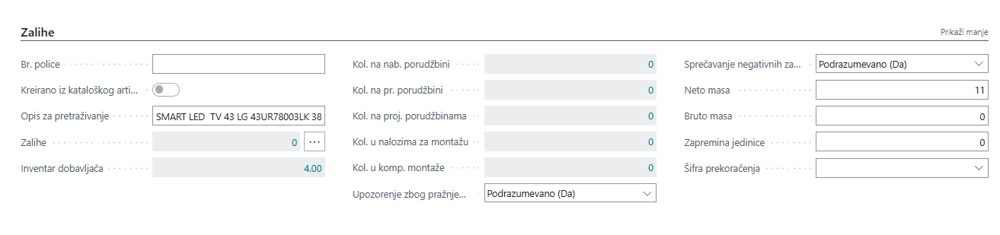

Kada se artikal objavi, on se kreira ili ažurira u WooCommerce-u sa svim mapiranim informacijama, uključujući:

- Naziv i opis artikla  
- Količinu zaliha  
- Slike  
- Cena (u skladu sa definisanim pravilima cena)  
- Kategorije i atribute  

> Ukoliko je opcija **Automatska sinhronizacija** omogućena (u podešavanju WooCommerce-a), objavljivanje može da se izvršava automatski pri promenama na artiklu.

---

### **1.2 Uklanjanje artikala**

Da biste uklonili artikal sa WooCommerce prodavnice:

1. Otvorite karticu artikla u Business Central-u.  
2. Onemogućite opciju **Objavi stavku na WooCommerce**.  

Ovim se proizvod neće izbrisati iz WooCommerce-a, već će mu status biti promenjen u „draft“ („nacrt“) ili „hidden“ („sakriven“) u zavisnosti od podešavanja, čime se onemogućava naručivanje od strane kupaca.

> Ova funkcionalnost je ključna za upravljanje proizvodima koji se prikazuju na vašoj WooCommerce prodavnici i za održavanje doslednosti i ažurnosti podataka direktno iz Business Central-a.

---

## **2. Sinhronizacija artikala**

Funkcionalnost **Sinhronizuj artikle** omogućava automatski prenos podataka o proizvodima iz Dynamics 365 Business Central-a u vašu WooCommerce prodavnicu. Time se obezbeđuje da artikli definisani u ERP sistemu budu vidljivi i dostupni za prodaju online, bez potrebe za duplim unosom podataka.

Kada objavimo artikal na WooCommerce i izvršimo određene izmene, te promene možemo ručno sinhronizovati sa WooCommerce-om pomoću akcije **Sinhronizuj promene sa WooCommerce-om** na kartici artikla.

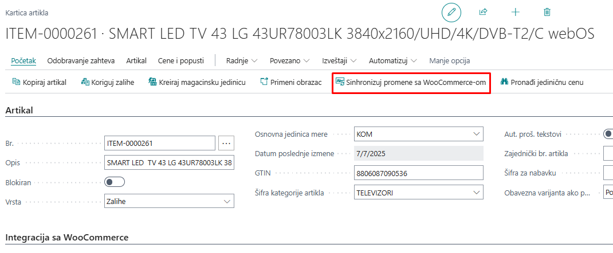

### **2.1 Automatska sinhronizacija**

Sekcija **Podešavanja automatske sinhronizacije** na stranici **Podešavanje WooCommerce-a** omogućava uključivanje automatske sinhronizacije podataka o artiklima iz Business Central-a u WooCommerce, u pozadini. Kada su ove opcije aktivirane, sistem će automatski slati izmene u WooCommerce svaki put kada se izvrše povezane promene u Business Central-u – čime se eliminiše potreba za ručnim sinhronizovanjem.

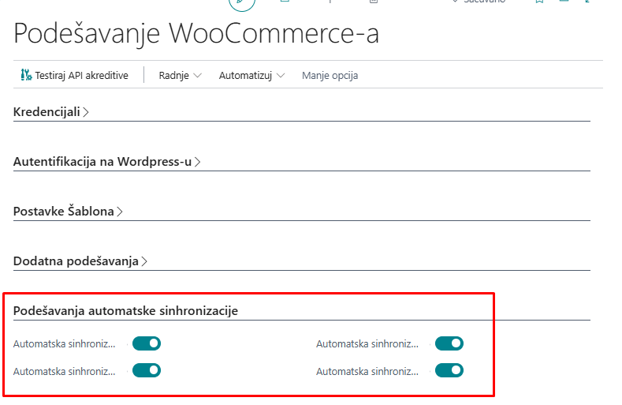

Dostupne opcije:

- **Automatska sinhronizacija stavke** – Automatski sinhronizuje izmene na artiklu (npr. naziv, opis, cena, zalihe) sa WooCommerce-om kada se kartica artikla izmeni u Business Central-u.

- **Automatska sinhronizacija kategorije artikla** – Automatski ažurira kategorije artikala u WooCommerce-u kada se kategorije kreiraju ili izmene u Business Central-u.

- **Automatska sinhronizacija atributa stavke** – Obezbeđuje da se atributi proizvoda (npr. boja, veličina, materijal) sinhronizuju sa WooCommerce-om u realnom vremenu kada se dodaju ili izmene.

- **Automatska sinhronizacija vrednosti atributa stavke** – Šalje izmene vrednosti atributa (npr. „Crvena“ za boju) u WooCommerce, obezbeđujući doslednost između ERP sistema i online prodavnice.

> Ova podešavanja su posebno korisna za preduzeća koja često ažuriraju svoj katalog proizvoda i žele da održe tačnost podataka u realnom vremenu između sistema.

> Uverite se da je WooCommerce API konekcija ispravno podešena i funkcionalna kako biste izbegli neuspele pokušaje sinhronizacije.

### **2.2 Ručna sinhronizacija**

Takođe možemo ručno pokrenuti akcije za sinhronizaciju artikala. Ove akcije se nalaze u podešavanjima WooCommerce-a.

- **Automatsko objavljivanje stavki** – Pokreće akciju koja automatski objavljuje artikle na WooCommerce.

- **Automatsko objavljivanje kategorija stavki** – Pokreće akciju koja automatski objavljuje kategorije artikala na WooCommerce.

- **Ažuriraj URL-ove slika** – Pokreće akciju koja ažurira URL-ove slika za sve artikle.

- **Poništi objavljivanje stavki koje prelaze maksimalnu težinu** – Pokreće akciju koja uklanja sa WooCommerce-a sve artikle čija težina prelazi maksimalno dozvoljenu.

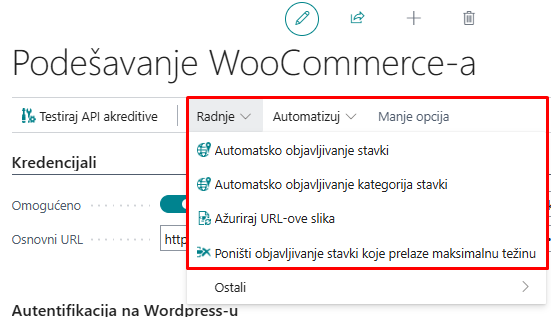

---

## 3. Kreiranje prodajnih naloga iz WooCommerce-a

Integracija između **WooCommerce-a** i **Microsoft Dynamics 365 Business Central-a** omogućava nesmetanu sinhronizaciju prodajnih naloga. Kada kupac izvrši porudžbinu u WooCommerce prodavnici, ta porudžbina se automatski preuzima i kreira kao **Prodajni nalog** u Business Central-u.

Ovaj proces obezbeđuje potpuno integrisan tok od online prodaje do pozadinskih poslovnih operacija, eliminišući potrebu za ručnim unosom i smanjujući rizik od grešaka.

---

### **3.1 Pregled procesa uvoza porudžbina**

Uvoz porudžbina iz WooCommerce-a obavlja se putem **Zahtevi za prijemno sanduče WooCommerce**, a proces se obično izvršava preko zakazanih zadataka (**Stavke reda čekanja za posao**). Ipak, postupak se može pokrenuti i ručno kada je to potrebno.

**Koraci u procesu kreiranja porudžbine:**

1. **Preuzimanje/uvoz porudžbina**  
  Porudžbine kreirane u WooCommerce-u preuzimaju se akcijom **Fetch WooCommerce Orders**. Ova akcija preuzima sve nove porudžbine i smešta ih u **Prijemno sanduče WooCommerce** unutar Business Central-a.

2. **Obrada zahteva**  
  Nakon uvoza porudžbina u inbox, funkcija **BCY Process Inbox Requests** obrađuje svaki zahtev i generiše odgovarajući **Prodajni nalog** u Business Central-u.

3. **Kreiranje prodajnog naloga**  
  Na osnovu podataka iz WooCommerce-a, kreira se kompletno strukturirani **Prodajni nalog**, 
  
koji uključuje:
  
- **Informacije o kupcu**  
- **Adrese za isporuku i naplatu**  
- **Poručeni artikli sa količinama i cenama**  
- **Načini isporuke i napomene**  
- **Detalji o plaćanju**

### **3.2 Automatizacija putem *Stavki reda čekanja za posao***

Proces uvoza porudžbina se najčešće automatizuje pomoću **Stavki reda čekanja za posao** u Business Central-u, i to kroz sledeće zadatke:

- **Fetch WooCommerce Orders**  
- **BCY Process Inbox Requests**  
- **BCY Woo Get Sales Orders**

Ovi zadaci su zakazani da se izvršavaju periodično, čime se omogućava kontinuirana sinhronizacija porudžbina između WooCommerce-a i Business Central-a bez potrebe za ručnom intervencijom.

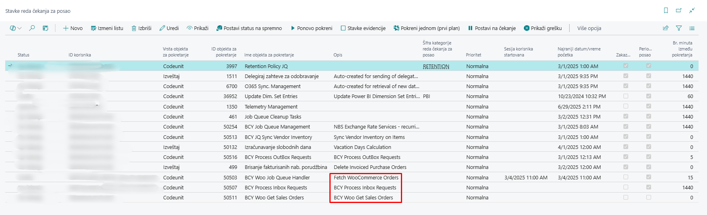

### **3.3 Ručno pokretanje procesa (opciono)**

Ukoliko je potrebno, ceo proces se može pokrenuti i ručno:

1. Otvorite stranicu **Zahtevi za prijemno sanduče WooCommerce**.  
2. Kliknite na **Preuzmi/Uvezi prodajne porudžbine** kako biste preuzeli najnovije porudžbine.  
3. Kada se porudžbine pojave u inbox-u, kliknite na **Obradi zahtev** da biste ih konvertovali u **Prodajne naloge**.

Ovaj ručni tok rada je posebno koristan tokom faza testiranja ili kada je potrebno rešavanje problema.

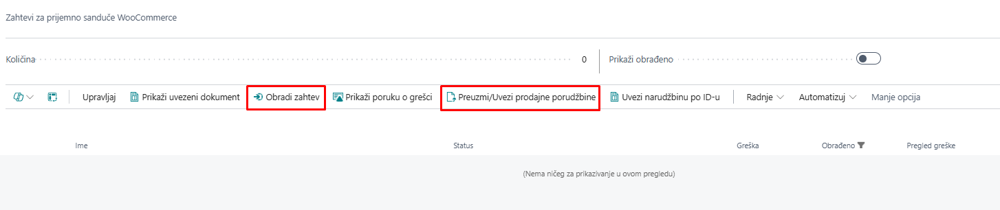

> **Napomena:** Porudžbine koje ne mogu biti obrađene zbog nedostajućih ili nevažećih podataka ostaće u **Prijemnom sandučetu** sa odgovarajućom porukom o statusu. Možete pregledati logove i preduzeti korektivne radnje pre ponovnog pokušaja obrade.

> **Preporuka:** Uvek se postarajte da su mapiranje artikala, šabloni kupaca, kao i metode isporuke i plaćanja ispravno konfigurisani kako biste izbegli greške pri uvozu.

---

## **4. Zahtevi za prijemno sanduče i odlaznu poštu WooCommerce**

Integracija između Business Central-a i WooCommerce-a obuhvata dva ključna elementa za upravljanje i praćenje razmene podataka:

- **Zahtevi za prijemno sanduče WooCommerce** – dolazni podaci (zahtevi iz WooCommerce-a)  
- **Zahtevi za odlaznu poštu WooCommerce** – odlazni podaci (zahtevi ka WooCommerce-u)  

Ove stranice omogućavaju korisnicima da prate tok informacija, pregledaju statuse i reše eventualne greške koje se pojave tokom sinhronizacije.

### **4.1 Zahtevi za prijemno sanduče WooCommerce**

**Zahtevi za prijemno sanduče WooCommerce** čuvaju podatke primljene sa WooCommerce prodavnice, kao što su:

- Nove porudžbine  
- Informacije o kupcima  
- Ažuriranja porudžbina  

Svaki zapis sadrži detaljne informacije, uključujući:

- Tip zahteva (npr. *Prodajni nalog*)  
- WooCommerce ID i vremensku oznaku  
- Status obrade (npr. *Na čekanju*, *Obradjen*, *Neuspešan*)  
- Povezane poruke o greškama  

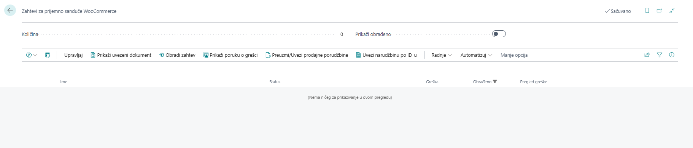

**WooCommerce Inbox – najčešće korišćene akcije:**

- **Preuzmi/Uvezi prodajne narudžbine**  
  Preuzima nove prodajne naloge iz WooCommerce-a i čuva ih kao dolazne zahteve u inbox-u.

- **Uvezi narudžbinu po ID-u**  
  Omogućava ručni uvoz određene porudžbine iz WooCommerce-a unošenjem njenog jedinstvenog **WooCommerce Order ID-ja**. Korisno za testiranje ili rešavanje posebnih slučajeva.

- **Obradi zahtev**  
  Obradjuje izabrani zahtev i pokušava da ih konvertuje u prodajne naloge u Business Central-u.

- **Prikaži uvezeni dokument**  
  Otvara dokument (npr. prodajni nalog) koji je kreiran kao rezultat uspešno obrađenog zahteva.

- **Prikaži poruku o grešci**  
  Prikazuje detalje o greškama ako obrada nije uspela. Pomaže u identifikaciji nedostajućih podataka ili neispravnih mapiranja.

**Kako funkcioniše:**  
- Podaci se preuzimaju korišćenjem akcije **Preuzmi/Uvezi prodajne narudžbines** (ručno ili preko **Stavki reda čekanja za posao**).  
- Zahtevi se pojavljuju u **Prijemnom sandućetu** i obrađuju putem funkcije **BCY Process Inbox Requests**.  
- Nakon obrade, kreiraju se zapisi (npr. prodajni nalozi) u Business Central-u i označavaju se kao završeni.  

> Zahtevi sa greškama ostaju u prijemnom sandučetu dok se ne isprave i ponovo obrade.

### **4.2 Zahtevi za odlaznu poštu WooCommerce**

**Zahtevi za odlaznu poštu WooCommerce** beleži sve odlazne podatke koje Business Central šalje ka WooCommerce-u, kao što su:

- Objavljeni ili ažurirani artikli  
- Promene kategorija i atributa  
- Ažuriranja cena ili zaliha  

**Zahtevi za odlaznu poštu WooCommerce – najčešće korišćene akcije:**

- **Procesuiraj**  
  Ručno šalje izabrani zapis iz outbox-a ka WooCommerce-u. Korisno za ponovno slanje neuspelih zahteva ili pokretanje sinhronizacije bez čekanja na zakazane zadatke.

- **Izbriši**  
  Briše izabrane zapise iz odlazne pošte. Korisno za čišćenje test podataka ili nevažećih zapisa koje ne želite ponovo da šaljete.

- **Prikaži povezani zapis**  
  Otvara odgovarajući zapis u Business Central-u (npr. karticu artikla) koji je inicirao zahtev za sinhronizaciju. Pomaže korisnicima da brzo dođu do izvora podataka.

- **Prikaži poruku o grešci**  
  Prikazuje opis greške za neuspele pokušaje sinhronizacije. Pomaže u identifikaciji problema kao što su nedostajuća polja, neispravna mapiranja ili problemi sa konekcijom.

- **Prikaži poruku zahteva**  
  Prikazuje ceo JSON zahtev koji je poslat ka WooCommerce-u. Korisno za naprednu dijagnostiku ili verifikaciju sadržaja poruke.

- **Prikaži poruku odgovora**  
  Prikazuje odgovor koji je WooCommerce poslao nakon obrade zahteva. Pomaže u razumevanju da li je sinhronizacija bila uspešna ili je WooCommerce vratio konkretnu grešku.

---

**Svaki zapis u odlaznoj pošti sadrži:**

- Tip operacije (*Kreiranje*, *Ažuriranje*, *Brisanje*)  
- Ciljani entitet (*Artikal*, *Kategorija* itd.)  
- Status rezultata (*Uspešno*, *Neuspešno*)  
- Poruku i odgovor WooCommerce-a  

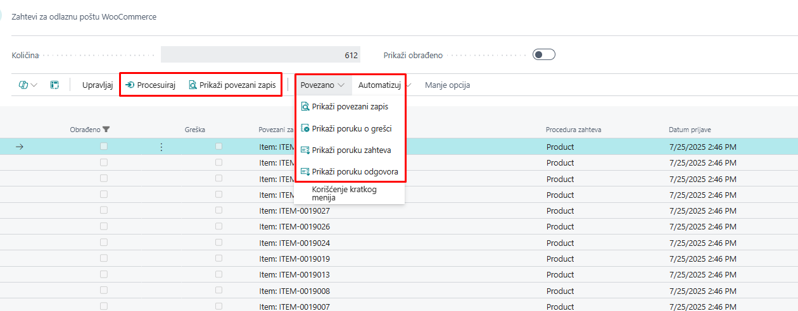

**Kako funkcioniše:**  

- Kada se artikal ili povezani podaci izmene, generiše se zapis u odlaznoj pošti.  
- Sistem šalje podatke ka WooCommerce-u putem API-ja (automatski ili ručno).  
- Status se ažurira na osnovu odgovora koji stigne od WooCommerce-a.

> Možete filtrirati zapise po statusu kako biste identifikovali neuspele pokušaje sinhronizacije i preduzeli korektivne mere.

### **4.3 Ručno i automatsko procesiranje**

I **prijemno sanduče** i **odlazna pošta** se mogu upravljati ručno od strane korisnika ili automatski putem zakazanih zadataka (**Stavke reda čekanja za posao**).  

Ove stranice pružaju potpunu transparentnost o tome koji podaci se razmenjuju između Business Central-a i WooCommerce-a i kada se to dešava.

> **Preporuka:** Redovno pratite stranice **prijemno sanduče** i **odlazna pošta**, naročito nakon masovnih ažuriranja ili promena u konfiguraciji.

---

## 5. **Podešavanje WooCommerce-a (AW)**

Stranica **Podešavanje WooCommerce-a** predstavlja glavni centar za upravljanje integracijom između WooCommerce-a i Microsoft Dynamics 365 Business Central-a. Na ovoj stranici definiše se kako i kada se vrši sinhronizacija, kako se mapiraju entiteti, kao i na koji način se obrađuju porudžbine i artikli.

Ovaj deo dokumentacije prikazuje polja za podešavanje i dostupne akcije za funkcionalnu kontrolu.

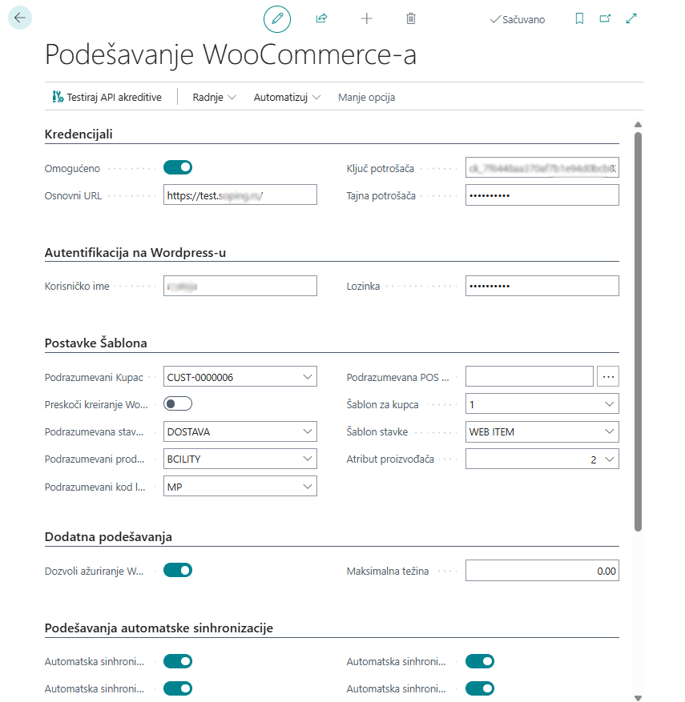

### **5.1 Glavna polja za podešavanje**

**Akreditivi (Credentials):**

- **Omogućeno**  
  Prekidač koji uključuje ili isključuje integraciju sa WooCommerce-om.

- **Osnovni URL**  
  URL vaše WooCommerce prodavnice. Ovo je osnovna adresa koja se koristi za svu API komunikaciju.

- **Ključ potrošača**  
  Javni ključ koji se koristi za autentifikaciju API zahteva iz Business Central-a ka WooCommerce-u.

- **Tajna potrošača**  
  Tajni ključ koji se koristi zajedno sa Ključem potrošača za sigurnu autorizaciju zahteva.

---

**Autentifikacija na Wordpress-u:**

- **Korisničko ime**  
- **Lozinka**

---

**Postavke šablona - podrazumevana podešavanja:**

- **Podrazumevani kupac**  
  Definiše podrazumevanog kupca ako korisnik nije registrovan na WooCommerce-u i koristi prodavnicu kao gost.

- **Preskoči kreiranje Woo kupaca**  
  Prekidač koji, kada je uključen, preskače kreiranje kupaca i koristi podrazumevanog kupca za goste.

- **Podrazumevani kod lokacije**  
  Određuje koja će lokacija zaliha u Business Central-u biti korišćena za sinhronizaciju količina sa WooCommerce-om.

- **Podrazumevani prodavac**  
  Definiše prodavca koji će automatski biti dodeljen uvezenim prodajnim nalozima.

- **Podrazumevana POS jedinica**  
  Definiše podrazumevanu POS jedinicu.

---

**Dodatna podešavanja:**

- **Dozvoli ažuriranje Woo ID**  
  Kada je uključeno, omogućava ručne izmene u WooCommerce-u na karticama artikala, atributa, kategorija itd.

- **Maksimalna težina**  
  Definiše dozvoljenu maksimalnu težinu artikala koji se objavljuju na WooCommerce-u.

---

### **5.2 Akcije (Traka sa alatkama)**

Gornja traka sa akcijama sadrži sledeće funkcije:

- **Testiraj API akreditive**  
  Pokreće test da li su uneti API akreditivi ispravni.

- **Automatsko objavljivanje, uklanjanje i ažuriranje** -
Više o ovim akcijama pogledajte u poglavlju o **[ručnoj sinhronizaciji](#22-rucna-sinhronizacija)**.
