# **Modul zaliha**

Iako se zalihe uglavnom pokrivaju kroz module **Nabavka** i **Prodaja**, u ovom modulu ćemo se fokusirati na:  

- **Proveru zaliha** unutar sistema  
- **Prenos zaliha** između različitih lokacija  

## **1. Provera zaliha**

Proveru zaliha u sistemu moguće je izvršiti na nekoliko načina. U ovom uputstvu pokrićemo najčešće korišćene metode.  

Jedan od načina je pregled liste artikala, gde kolona **Zalihe** prikazuje ukupnu zalihu određenog artikla u sistemu.  

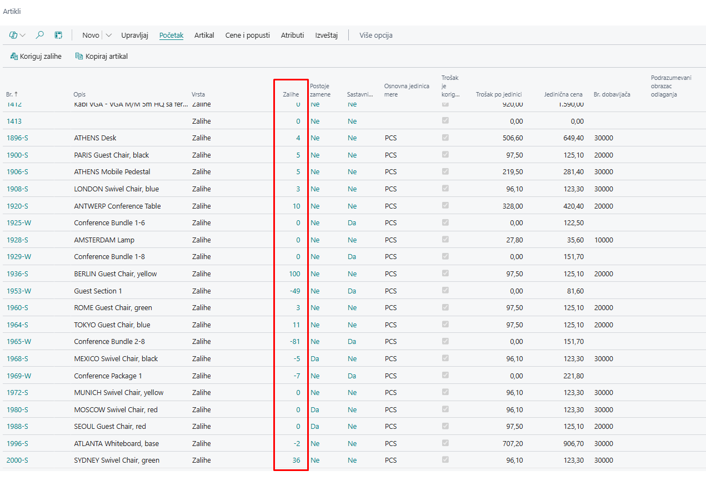

Kolona **Zalihe** predstavlja sumu svih stavki analitike artikla. Pored ukupne zalihe, putem analitike možemo pristupiti i dodatnim podacima kao što su:  

- **Rezervisana količina**  
- **Jedinični trošak**  
- **Preostala količina**  
- **Ostali relevantni podaci**  

Jedan od najlakših načina za pregled stavki analitike dostupne količine je otvaranje stranice sa filterom **Otvoreno = DA**. Ovaj filter prikazuje sve stavke koje su trenutno dostupne, ali treba imati na umu da iste stavke mogu biti rezervisane, zbog čega je važno pratiti i kolonu **Rezervisana količina**.  

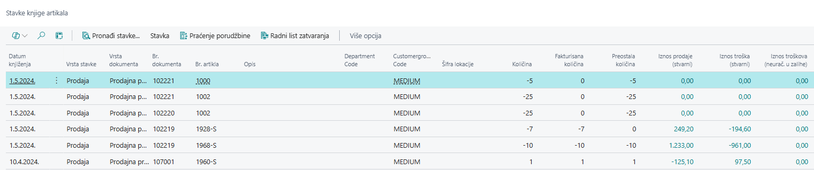

Ako želite saznati koliko određenog artikla imate na pojedinim dokumentima, tu informaciju možete pronaći na **kartici artikla**, u brzoj kartici **Zalihe**.  

Za svako od prikazanih polja moguće je dobiti detaljan pregled količine tako što kliknete na broj.  

Na primer, ako želite videti količinu na redovima nabavne porudžbine, klikom na broj prikazaće se dokumenti na kojima se ta zaliha nalazi.  

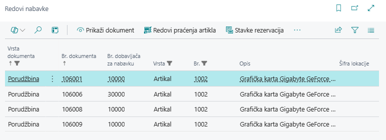

Još jedan način za pregled trenutne zalihe je korišćenjem alatne trake:  
**Artikal → Raspoloživost artikla po** (sa liste ili kartice artikla).  

Ova opcija omogućava različite prikaze zalihe, uključujući:  

- **Raspoloživost zalihe** prema događaju  
- **Pregled po periodu**  
- **Razlikovanje po varijanti artikla**  
- **Raspored zalihe po lokaciji**  
- **Pregled po nivou sastavnice**  
- **Prikaz prema jedinici mere**  

Ovi prikazi omogućavaju detaljan uvid u stanje zaliha i njihovu dostupnost u različitim kontekstima.  

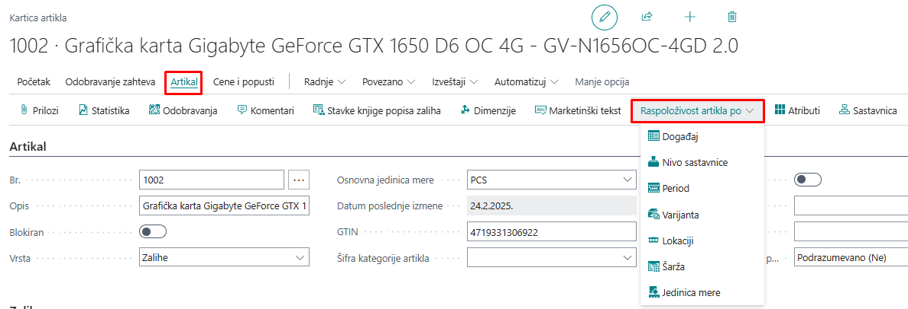

## **2. Prebacivanje zaliha na drugu lokaciju**

**Nalog za prenos**  

Za manipulaciju artiklima u skladištu koristi se dokument **Nalog za prenos**. Ovaj dokument služi za prebacivanje jednog ili više artikala sa jedne lokacije na drugu.  

**Direktni prenos**  

Ako se polje **Direktni prenos = DA** postavi, roba se direktno prebacuje bez tranzitnog perioda. U tom slučaju sistem automatski knjiži:  

- **Otpremnicu prenosa**  
- **Priznanicu prenosa**  

Ako je deo robe već otpremljen i primljen, polje **Direktni prenos** više nije moguće menjati.  

**Prenos sa tranzitom**  

Ako se koristi tranzit, proces se odvija u dva koraka:  

1. **Knjiženje otpremnice** – roba napušta skladište.  
2. **Knjiženje prijema** – kada roba stigne na odredišnu lokaciju, korisnik evidentira njen prijem.  

**Pronalaženje naloga za prenos**  

Listu svih kreiranih naloga za prenos koji još nisu obrađeni možete pronaći unosom **"nalozi za prenos"** u pretragu. Svaki korisnik vidi samo naloge koji se odnose na magacine za koje je zadužen.  

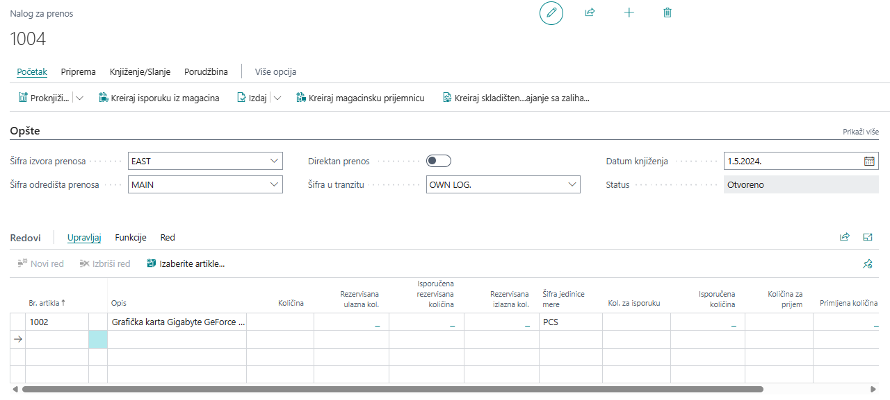

### **2.1 Kreiranje naloga za prenos**

Prilikom kreiranja **Naloga za prenos**, određena polja se automatski ili ručno popunjavaju:  

- **Polje Br.** – Popunjava se automatski prelaskom na bilo koje drugo polje. Sistem dodeljuje naredni slobodan broj iz definisane brojčane serije.  
- **Šifra izvora prenosa** – Lokacija (magacin) sa koje se artikli prenose.  
- **Šifra odredišta prenosa** – Lokacija (magacin) na koju se artikli prenose.  
- **Šifra u tranzitu** – Tranzitna lokacija na kojoj se artikli nalaze od trenutka isporuke sa izvorne lokacije do prijema na odredište.  
- **Datum knjiženja** – Datum pod kojim se kreira nalog za prenos.  

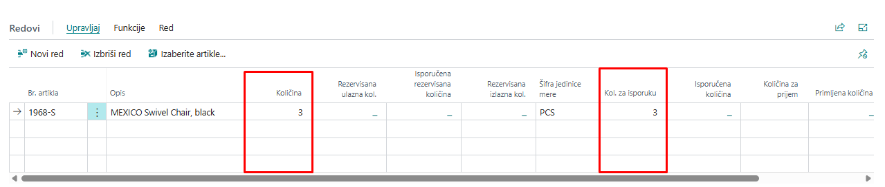

U okviru redova **Naloga za prenos** unose se podaci o artiklima koji se prenose:  

- **Br. artikla** – Izbor artikla koji se prenosi.  
- **Količina** – Unos ukupne količine za prenos.  
- **Količina za isporuku** – Automatski se popunjava na osnovu unete količine, ali može se ručno izmeniti ako je potrebno podeliti isporuku na više delova.  

**Definisanje datuma isporuke i prijema**  

- **Datum isporuke** – Planirani datum isporuke artikala.  
- **Datum prijema** – Planirani datum prijema na odredišnu lokaciju.  

Ove datume možete uneti direktno u redovima naloga ili u okviru brzih tabova **Prenos iz** i **Prenos u**.  

### **2.2 Knjiženje isporuke i prijema**

Kada ste popunili nalog za prenos relevantnim podacima, možete izvršiti evidentiranje istog u sistemu. U okviru komandne trake izaberite akciju *Proknjiži*, a potom *Isporuči*. 

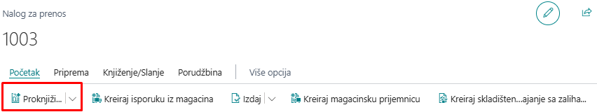

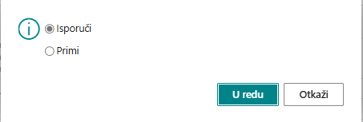

Pokretanjem ove akcije, polje **Status** će dobiti vrednost **Izdato**, nakon čega polja na nalogu za prenos više neće biti moguće menjati.  

Takođe, primetićete da su se podaci u okviru redova naloga izmenili, kao što je prikazano na slici:  

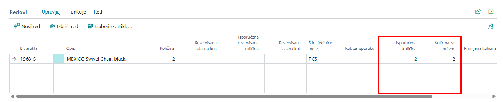

Možemo primetiti da je planirana količina za isporuku u potpunosti realizovana, što znači da je potrebno izvršiti prijem iste količine.  

Da biste to uradili, ponovo izaberite akciju **Proknjiži** u okviru komandne trake, a zatim kliknite na **Primi**.  

> **Napomena:** Ako pokušate da izaberete opciju **Isporuči**, sistem će vas obavestiti da nema preostale količine za isporuku.  

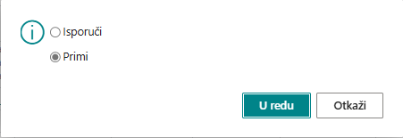

Nakon što potvrdimo ovu akciju, pojaviće se sledeće obaveštenje:

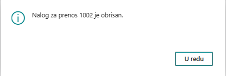

Nakon što je **nalog za prenos** u potpunosti realizovan, on više neće biti prisutan na listi **otvorenih** i **izdatih naloga za prenos**.  

U slučaju da ste pogrešno evidentirali prenos sa jednog magacina na drugi, potrebno je da kreirate novi nalog za prenos u suprotnom smeru, sa istom količinom artikala (u našem primeru sa magacina na magacin, količina 15).  

Kada to uradite, možete otvoriti novi nalog za prenos sa ispravnim podacima.  

## **3. Nalog preklasifikacije artikala**

Još jedan način prenosa zaliha na drugu lokaciju jeste korišćenje **naloga preklasifikacije artikala**. Ovaj nalog omogućava da se:  

- Prebaci artikal sa jedne lokacije na drugu  
- Promeni dimenzija artikla  
- Postavi artikal na drugi regal  

Za ovu vrstu prenosa potrebno je samo popuniti odgovarajuće kolone i proknjižiti nalog.  

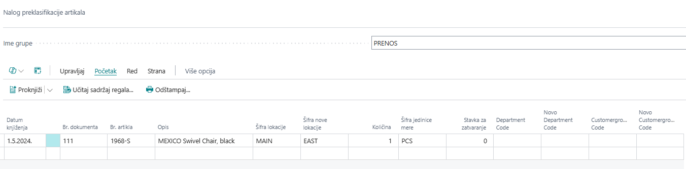

S obzirom da se radi o nalogu, ne postoji nikakav dokument koji ćete imati nakon knjiženja, jedino stavke glavne knjige te stavke analitike artikla. 

## **4. Nalog artikla**

Za knjiženje naloga poput naloga manjka, viška, promene šifre artikla i korekcije zaliha na stanju koristi se funkcionalnost **Nalog artikla**.

### **4.1 Obrasci naloga artikla**

Obrasce naloga artikla možemo da otvorimo ukoliko u pretrazi ukucamo obrasci naloga artikla. Nakon otvaranja prikazaće nam se svi obrasci koje smo do sada kreirali.

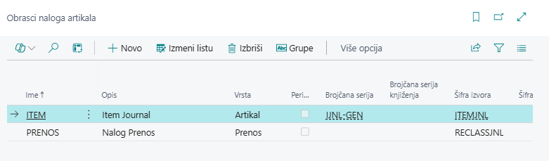

1. Stanite u kolonu **Ime** i pritisnite dugme **Novo**.  
2. U polje **Ime** unesite oznaku obrasca naloga artikla koji kreirate.  
3. U polje **Opis** upišite naziv obrasca naloga artikla.  
4. U polje **Vrsta** izaberite opciju **Artikal**.  
5. U polju **Šifra izvora** izaberite **NAL_ART**.  

Nakon što popunite ova polja, budite i dalje pozicionirani u istom redu i kliknite na dugme **Grupe**, kako biste mogli da vidite koje su grupe naloga povezane sa ovim nalogom artikla.  

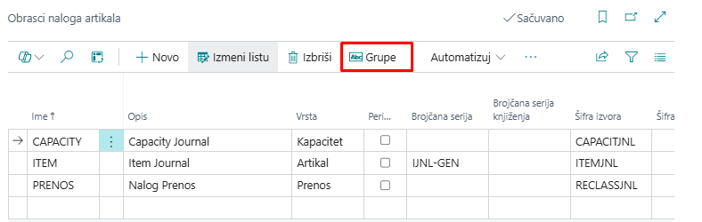

### **4.2 Nalog artikla**

Pretpostavimo da smo primili robu na punu količinu, ali kasnije, prilikom prebrojavanja, utvrdili manjak. U tom slučaju, želimo da količinu u ERP-u prilagodimo stvarnom stanju.  

Da bismo to postigli, potrebno je izvršiti korekciju u sistemu, kako bi se ažurirale zalihe prema stvarnoj količini u skladištu. Biramo obrazac artikla i pristupamo njegovom knjiženju.

#### **4.2.1 Postavljanje naloga za korekciju zaliha**  

1. **Ime grupe** – Biramo ime grupe naloga. U našem slučaju, izabrali smo **Roba**.  
2. **Datum** – Unosimo datum na koji želimo da proknjižimo nalog.  
3. **Vrsta stavke** – Ovo je vrlo bitno polje. Uz pomoć njega određujemo da li želimo da povećamo ili smanjimo količinu na zalihama. U našem slučaju, pošto je manjak, izabraćemo **Negativnu Korekciju**.  
4. **Broj dokumenta** – Unosimo broj pod kojim želimo da proknjižimo nalog.  
5. **Br. artikla** – Unosimo broj artikla za koji vršimo korekciju.  
6. **Šifra lokacije** – Unosimo lokaciju sa koje vršimo korekciju.  
7. **Količina** – Unosimo količinu koja se korektuje.  
8. **Br. stavka za zatvaranje** – Biramo stavku iz stavke knjige artikala sa kojom želimo da povežemo ovo knjiženje.  

## **5. Nalog popisa zaliha**  

Popis zaliha je jedan od ključnih procesa svakog preduzeća, a sistem **Dynamics 365 Business Central** ima implementiranu funkcionalnost za ovaj proces putem **naloga popisa zaliha**.  

**Nalog popisa zaliha** u magacinu omogućava periodično upoređivanje količine zaliha evidentiranih u sistemu sa fizičkom količinom zaliha u magacinu, kako bi se u svakom trenutku imao tačan podatak o stanju zaliha.  

Da biste izračunali zalihe na određeni datum, izaberite opciju **Radnja → Funkcije → Izračunaj zalihe**, nakon čega možete izabrati datum na koji želite da izračunate zalihe na osnovu stanja u sistemu.  

Nakon pokretanja akcije, nalog se popuni s artiklima i njihovim zalihama. 

Kada promenite polje **Kol. (fizička zaliha)**, sistem automatski menja **Vrstu stavke**. Ako je fizička količina veća od izračunate, biće postavljena **Pozitivna korekcija**, dok će u suprotnom biti odabrana **Negativna korekcija**.  

Pre nego što izvršite knjiženje, potrebno je još da popunite sledeća polja:

- **Opšta poslovna grupa knjiženja**  
- **Opšta grupa knjiženja proizvoda**  