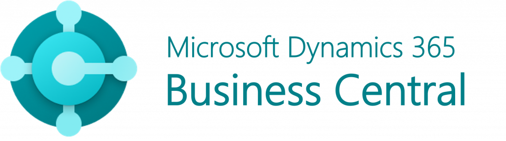

# Dobrodošli u BCILITY dokumentaciju

## O nama

**Bcility** je kompanija iz Čačka specijalizovana za **Microsoft Dynamics 365 Business Central** i integraciju **WooCommerce** platforme sa Business Central-om. Naš cilj je da pomognemo preduzećima da optimizuju svoje poslovanje koristeći moć Business Central-a, automatizuju radne tokove i pojednostave upravljanje e-trgovinom.

&nbsp;
&nbsp;

## **Dokumentacija za Business Central i WooCommerce**

## O nama

**Bcility** je kompanija iz Čačka specijalizovana za **Microsoft Dynamics 365 Business Central** i integraciju **WooCommerce** platforme sa Business Central-om. Naš cilj je da pomognemo preduzećima da optimizuju svoje poslovanje koristeći moć Business Central-a, automatizuju radne tokove i pojednostave upravljanje e-trgovinom.

## Šta je Business Central?

**Microsoft Dynamics 365 Business Central** je sveobuhvatno ERP (**Enterprise Resource Planning**) rešenje namenjeno malim i srednjim preduzećima. Omogućava **upravljanje finansijama, prodajom, nabavkom, zalihama i lancem snabdevanja**. Business Central pomaže preduzećima da automatizuju i poboljšaju svoje procese, omogućavajući donošenje boljih poslovnih odluka i povećanje efikasnosti.

Uz našu ekspertizu, omogućavamo besprekornu integraciju između **WooCommerce** platforme, jedne od najpopularnijih e-trgovinskih platformi, i Business Central-a. To preduzećima omogućava efikasno upravljanje porudžbinama, praćenje zaliha i sinhronizaciju podataka između online prodavnica i ERP sistema.

**** Za sva pitanja, kontaktirajte naš tim za podršku.***
