#Modul nabavke

Modul nabavke u Microsoft Dynamics 365 Business Central omogućava upravljanje celokupnim procesom nabavke robe od dobavljača. Omogućava praćenje informacija o artiklima, dobavljačima i njihovim kontaktima, kao i rad s nabavnim dokumentima poput narudžbenica, ulaznih faktura i odobrenja. Pored toga, modul podržava planiranje nabavke, analize, izveštaje i praćenje neskladištenih artikala. Kako bi sistem precizno beležio sve relevantne podatke o nabavci, neophodno je izvršiti odgovarajuća podešavanja.

## 1. Podešavanje nabavki i dugovanja

Kartica **Podešavanje nabavke i dugovanja** u Microsoft Dynamics 365 Business Central sadrži ključna podešavanja potrebna za pravilno funkcionisanje procesa nabavke. Slično karticama artikla, kupca i dobavljača, i ova kartica je organizovana u nekoliko brzih kartica, gde su podešavanja grupisana radi bolje preglednosti. Detaljan prikaz možete videti na slici ispod.

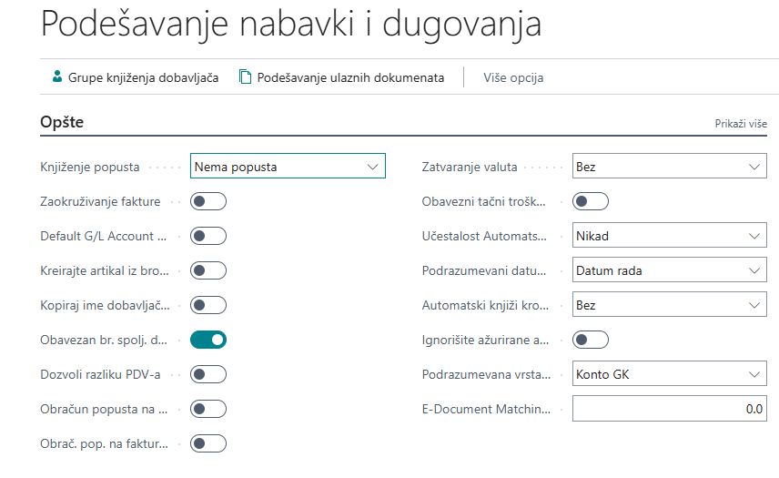

### 1.1 Opšte  
Ova brza kartica omogućava podešavanje osnovnih parametara za nabavku, uključujući:  

- **Knjiženje popusta** – određuje način knjiženja popusta:  
  &nbsp;&nbsp;- *Bez popusta* – popust se ne knjiži zasebno, već se umanjuje pre knjiženja.  
  &nbsp;&nbsp;- *Popust na fakturu* – popust se posebno knjiži uz iznos fakture.  
  &nbsp;&nbsp;- *Popust na red* – popust se knjiži uz pojedinačne stavke fakture.  
  &nbsp;&nbsp;- *Svi popusti* – kombinuje knjiženje popusta na fakturu i stavke.  
- **Prijemnica uz fakturu (DA/NE)** – određuje da li se faktura automatski knjiži uz prijemnicu.  
- **Zaokruživanje iznosa fakture (DA/NE)** – omogućava automatsko zaokruživanje iznosa fakture.  
- **Kopiraj ime dobavljača na stavke (DA/NE)** – ime dobavljača se prenosi na analitičke stavke.  
- **Obavezan broj spoljnog dokumenta (DA/NE)** – određuje da li je broj fakture ili odobrenja obavezan unos.  
- **Zatvaranje valuta** – određuje u kojoj meri se stavke mogu zatvarati u različitim valutama:  
  &nbsp;&nbsp;- *Nema* – zatvaranje je moguće samo unutar iste valute.  
  &nbsp;&nbsp;- *EMU* – omogućava zatvaranje između eura i nacionalnih valuta u EMU državama.  
  &nbsp;&nbsp;- *Sve* – stavke u bilo kojim valutama mogu se međusobno zatvarati.  
- **Obavezni tačni troškovi povratka (DA/NE)** – onemogućava knjiženje povrata bez unosa tačnih stavki prijemnice.  
- **Provera akontacija/avansa kod knjiženja (DA/NE)** – aktivira upozorenje ako nalog sadrži neplaćeni avans.  
- **Podrazumevani datum knjiženja** – određuje način unosa datuma knjiženja:  
  &nbsp;&nbsp;- *Datum obrade* – automatski postavlja datum obrade.  
  &nbsp;&nbsp;- *Nema datuma* – polje ostaje prazno i unosi se ručno.  
- **Podrazumevana količina za prijem** – automatski postavlja količinu prijema na dokumentima.  
- **Kopiraj opis reda u stavke glavne knjige (DA/NE)** – opis iz dokumenta se prenosi u stavke glavne knjige.  

### 1.2 Brojčane serije  
Omogućava definisanje brojčanih serija koje će se koristiti za matične podatke i dokumente unutar modula nabavke.  

### 1.3 Knjiženje u pozadini  
Ako poslovni procesi zahtevaju automatsko knjiženje, ovde se može aktivirati za nabavne dokumente.  

### 1.4 Arhiviranje  
Definiše koji nabavni dokumenti će biti sačuvani u arhivi.  

### 1.5 Razmena podataka  
Omogućava podešavanje podrazumevanih potražnih i dugovnih računa za stavke bez artikla na ulaznom odobrenju.  

Ova podešavanja omogućavaju efikasno praćenje i upravljanje procesima nabavke u sistemu.

## 2. Proces nabavke

Sledeći dokumenti se koriste za evidentiranje nabavnih transakcija u Microsoft Dynamics 365 Business Central programu:

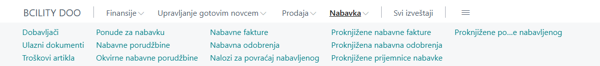

Proces nabavke započinje unosom **Ponude za nabavku** ili **Okvirnih nabavnih porudžbina**, koje mogu biti pretvorene u **Nabavnu porudžbinu**. Kada se izvrši knjiženje prijema na porudžbini, nastaje *prijemnica nabavke*, čime se povećava količina artikala na zalihama. Knjiženjem *ulazne fakture* proknjižava se faktura, a ažuriraju se podaci na kartici dobavljača, informacije o artiklu i račun GK. Na kraju, knjiženjem uplate dobavljaču vrši se ažuriranje kartice dobavljača i računa GK.

U sistemu, na redovima dokumenata nabavke, u polje **Vrsta** moguće je odabrati sledeće entitete za koje se vrši knjiženje nabavke:

- **Artikal** – uključuje standardne artikle kao što su roba, sirovine, gotovi proizvodi ili usluge poput konsultacija.
- **Osnovna sredstva** – odnosi se na nabavku osnovnih sredstava i sitnog inventara.
- **Konto GK** – koristi se za direktno knjiženje na konta Glavne knjige, na primer, troškove perioda.
- **Trošak (artikl)** – obuhvata dodatne troškove u procesu nabavke koji omogućavaju pravilno vrednovanje zaliha, kao što je trošak prevoza.

U narednom tekstu biće detaljnije objašnjeni dokumenti u procesu nabavke.

### 2.1 Ponuda za nabavku

**Ponuda za nabavku** je dokument koji inicira proces nabavke. Ako korisnik ima postavljen centar uloga **Business Manager**, ponudi za nabavku može pristupiti direktno sa početne stranice, jer je među dostupnim akcijama. Takođe, ponuda za nabavku može biti pronađena i putem pretraživača.

Nova ponuda za nabavku obično se kreira kada stigne ponuda od jednog ili više dobavljača, a postoji potreba da se unese u sistem. Da biste kreirali novu ponudu za nabavku, kliknite na dugme **Novo** u listi ponuda za nabavku. Kao i svi drugi dokumenti u **Business Centralu**, ponuda za nabavku se sastoji od **zaglavlja** i **redova**.

- **Zaglavlje** sadrži informacije o dobavljaču, datumima, podacima vezanim za fakturisanje i otpremu.
- **Redovi** sadrže artikle, osnovna sredstva, račune GK ili troškove artikla, kao što je opisano u prethodnom delu.

Za odabranu vrstu u redu ponude moguće je uneti dodatne informacije kao što su količina, šifra lokacije na koju će se knjižiti prijem, jedinica mere, jedinični trošak, popust na red i drugi relevantni podaci.

U nastavku je prikazan primer ponude za nabavku sa jednim artiklom i količinom od 10 komada.

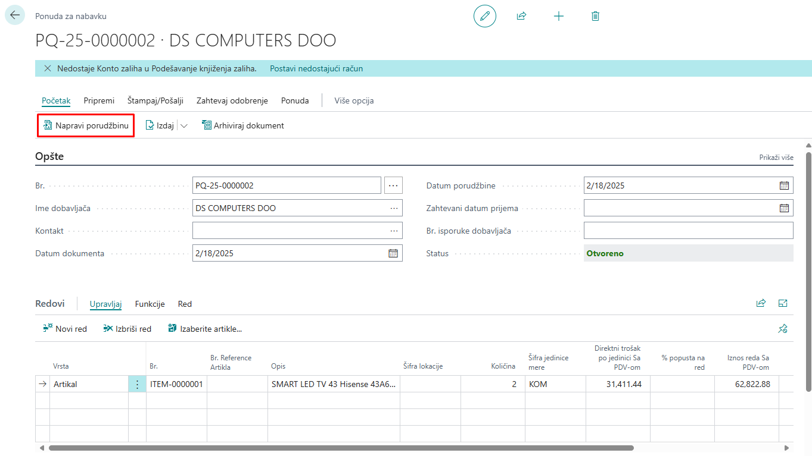

Kada su cena, stanje i način plaćanja usaglašeni s dobavljačem, nabavka se može konvertovati u narudžbenicu izborom akcije **"Napravi porudžbinu"**.  

Klikom na ovu opciju u okviru liste **"Ponuda za nabavku"**, dokument ponude se uklanja, a automatski se kreira novi dokument **"Nabavna porudžbina"**.  

Nabavna porudžbina kreirana na ovaj način preuzima sve podatke iz zaglavlja i stavki iz originalne ponude za nabavku.

### 2.2 Okvirna nabavna porudžbina

Pored **Ponude za nabavku**, proces nabavke može započeti i putem **Okvirne nabavne porudžbine**.  

**Okvirna nabavna porudžbina** predstavlja dogovor s dobavljačem o nabavci određenog broja artikala u definisanom vremenskom periodu. Kada se javi potreba za određenom količinom tih artikala, okvirna porudžbina može se pretvoriti u **Nabavnu porudžbinu**.  

Na primer, ako je s dobavljačem ugovorena nabavka **100 komada** određenog artikla u određenom periodu, sa isporukama po **10 komada svake sedmice**, moguće je više puta kreirati porudžbinu iz okvirne porudžbine, koristeći opciju **"Napravi porudžbinu"**. Svaka kreirana porudžbina odnosi se na količinu koja je u tom trenutku potrebna i koja se unosi u polje **"Kol. za prijem"**.  

Nakon knjiženja prijema na porudžbenici, ažuriraju se polja **"Kol. za prijem"** i **"Primljena količina"** na redovima okvirne porudžbine.  

Struktura **Okvirne nabavne porudžbine** slična je **Ponudi za nabavku**, jer se sastoji od zaglavlja i redova sa većinom istih polja.

Prikaz okvirne porudžbenice:

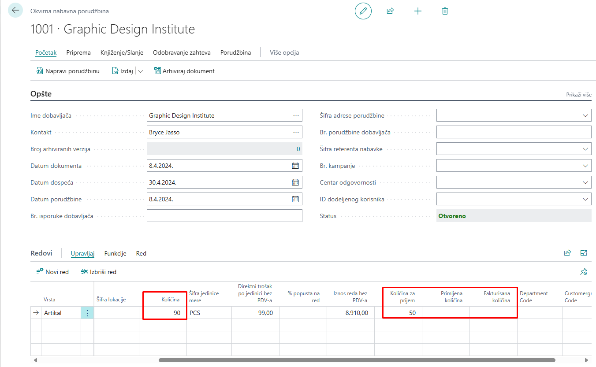

Knjiženjem **Nabavne porudžbine** nastalih iz **Okvirne nabavne porudžbine**, lako se može pratiti njihov status.  

Provera polja **"Kol. za prijem"**, **"Primljena količina"** i **"Fakturisana količina"** na redovima okvirne porudžbine omogućava uvid u trenutno stanje realizacije dogovorene nabavke.

### 2.3 Nabavna porudžbina

**Nabavna porudžbina** predstavlja ključni dokument u upravljanju procesom nabavke unutar sistema **Microsoft Dynamics 365 Business Central**. Koristi se za evidenciju troškova nabavke i praćenje obaveza prema dobavljačima.  

Nabavne porudžbine su neophodne u slučaju **delimičnih prijema**, kada celokupna količina naručenih artikala nije odmah dostupna kod dobavljača.  

#### 2.3.1 Kreiranje nabavne porudžbine  

Nabavna porudžbina može se kreirati na nekoliko načina:  
- **Iz ponude za nabavku**  
- **Iz okvirne nabavne porudžbine**  
- **Ručno**  

Korisnici sa podešenom ulogom **Business Manager** mogu pristupiti nabavnim porudžbinama direktno sa **početne stranice**, gde se nalaze među dostupnim akcijama. Takođe, moguće ih je pronaći putem **pretraživača**.  

Za kreiranje nove nabavne porudžbine:  
1. Otvorite listu **Nabavne porudžbine**  
2. Izaberite opciju **"Novo"**  

Kartica nabavne porudžbine prikazana je na slici ispod:

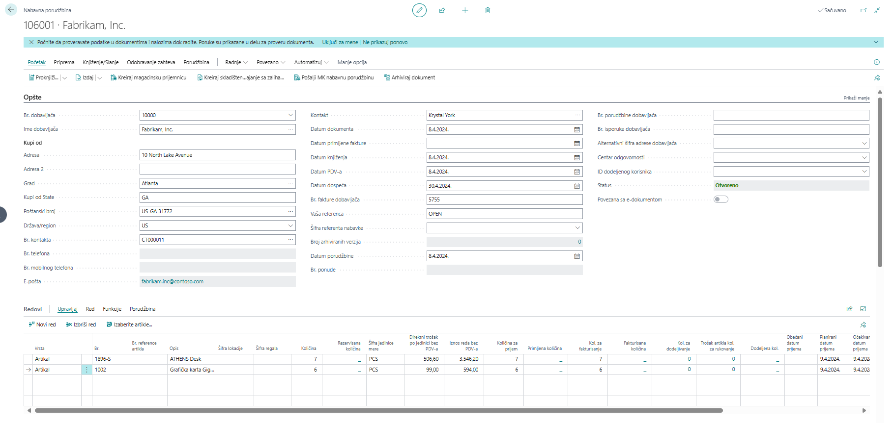

***Struktura nabavne porudžbine***  

Kao i **Ponuda za nabavku** i **Okvirna nabavna porudžbina**, dokument **Nabavne porudžbine** sastoji se od **zaglavlja** i **redova**.  

**Zaglavlje** je podeljeno na više **brzih kartica**, koje sadrže relevantna polja. Klikom na **"Prikaži više"**, mogu se prikazati dodatna polja i popuniti potrebni podaci.  

U **redove** se mogu unositi:  
- **Artikli**  
- **Dugotrajna imovina**  
- **Račun glavne knjige (GK)**  
- **Trošak artikla**  

Unosom vrednosti u polje **"Količina"**, automatski se popunjavaju polja **"Kol. za prijem"** i **"Kol. za fakturisanje"**, ali samo ako je u podešavanjima nabavke u polju **"Podrazumevana kol. za prijem"** odabrana opcija **"Preostalo"**. U suprotnom, ova polja ostaju prazna.  

Sistem ne dozvoljava:  
- **Prijem veće količine** od one unete u polju **"Količina"** (ako se unese veća vrednost, sistem javlja grešku).  
- **Fakturisanje veće količine** od one koja je primljena.  

Moguće je primiti **manju količinu** od unete u polju **"Količina"**, čime dolazi do **delimičnog prijema**, a preostala količina može se kasnije knjižiti kada je dobavljač isporuči.  

#### 2.3.2 Knjiženje nabavne porudžbine  

Knjiženje nabavne porudžbine vrši se izborom opcije **"Proknjiži"**, nakon čega se otvara prozor sa sledećim opcijama:  

- **Primi** – Knjiži se samo prijem artikala prema količini u polju **"Kol. za prijem"**.  
  - Ažuriraju se polja **"Kol. za prijem"** i **"Primljena količina"**.  

- **Fakturiši** – Knjiži se samo fakturisanje prema količini u polju **"Kol. za fakturisanje"**.  
  - Ažuriraju se polja **"Kol. za fakturisanje"** i **"Fakturisana količina"**.  
  - **Napomena:** Nije moguće fakturisati veću količinu od one u polju **"Primljena količina"**.  

- **Primi i fakturiši** – Knjiži se i prijem i fakturisanje.  
  - Ažuriraju se polja **"Kol. za prijem"**, **"Primljena količina"**, **"Kol. za fakturisanje"** i **"Fakturisana količina"**.  

Knjiženjem prijema nastaje dokument **Proknjižena prijemnica nabavke**, a knjiženjem fakturisanja dokument **Proknjižena ulazna faktura**.  

Knjiženje prijema i fakturisanja takođe generiše:  
- **Stavke analitike artikala**  
- **Stavke vrednosti**  
- **Stavke glavne knjige (GK)**  
- **Stavke PDV-a**  
- **Stavke analitike dobavljača**  

Ako su prijem i fakturisanje celokupne količine završeni, **Nabavna porudžbina se automatski briše**, a dokaz o primljenoj i fakturisanoj količini ostaju **Proknjižena prijemnica nabavke** i **Proknjižena ulazna faktura**.  

#### 2.3.3 Kreiranje nabavne porudžbine iz prodajne porudžbine  

**Nabavna porudžbina** može se kreirati direktno iz **Prodajne porudžbine**, kada na prodajnoj porudžbini postoji artikal kojeg nema dovoljno na zalihama.  

Postupak kreiranja:  
1. Na prodajnoj porudžbini kliknite na **Radnje -> Funkcije -> Kreiraj nabavni dokument -> Kreiraj nabavne porudžbine**.  
2. U otvorenom prozoru unesite željenu količinu za nabavku.  
3. Kliknite **"U redu"**, čime se kreira nova nabavna porudžbina.  

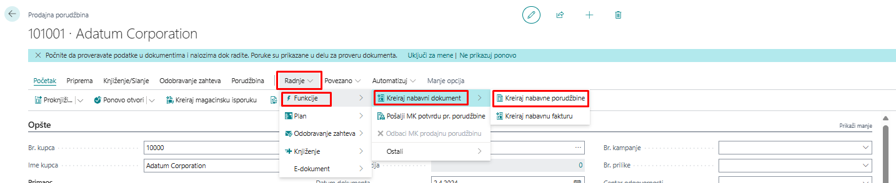

Pojaviće se prozor na kom je potrebno uneti željenog dobavljača i količinu za nabavku 

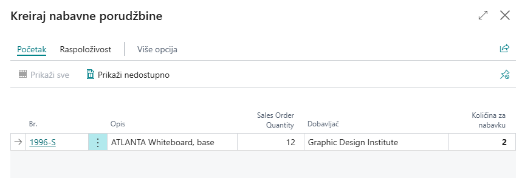

U dnu prozora nalazi se dugme **U redu**, klikom na to dugme biće kreirana ***Nabavna porudžbina***.

### 2.4 Nabavna faktura 

#### 2.4.1 Kreiranje nabavne fakture  

Proces kreiranja **Nabavne fakture** veoma je sličan kreiranju **Nabavne porudžbine**.  

**Nabavna faktura** se koristi u situacijama kada je potrebno evidentirati samo **fakturisanje**, bez povezivanja sa procesom prijema robe.  

Osim fakturisanja pojedinačne porudžbine, nabavna faktura omogućava i fakturisanje **više prijemnica nabavke odjednom**, čak i ako dolaze iz **različitih nabavnih porudžbina**.  

Za dodavanje stavki iz više prijemnica koristi se funkcija:  
**Red > Funkcije > Učitaj redove prijemnice…**  

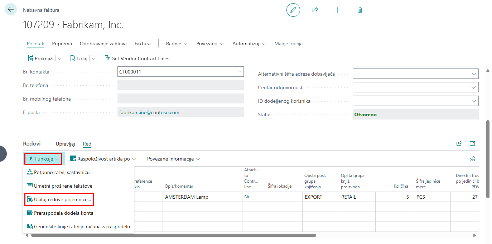

#### 2.4.2 Fakturisanje sa nabavne porudžbine  

Fakturisanjem direktno sa **Nabavne porudžbine** moguće je fakturisati **samo artikle iz te porudžbine**.  

Međutim, ako dobavljač na jednoj fakturi navodi stavke iz **više nabavnih porudžbina i prijemnica**, tada fakturisanje sa pojedinačne porudžbine **nije opcija**.  

#### 2.4.3 Kreiranje nabavne fakture za više porudžbina  

U takvim slučajevima potrebno je kreirati **novu Nabavnu fakturu**, koja se sastoji od **zaglavlja** i **redova** i veoma je slična Nabavnoj porudžbini.  

Postupak kreiranja:  
1. **Popuniti podatke u zaglavlju** – ovo se radi ručno.  
2. **Ne unositi redove ručno** – iako je to moguće, ručni unos može dovesti do **duplog prijema artikala**, jer su oni već primljeni knjiženjem prijemnice opcijom **"Primi"** na porudžbini.  

#### 2.4.4 Automatsko dodavanje redova iz prijemnica  

Za pravilan unos redova koristi se funkcija:  
**Red > Funkcije > Učitaj redove prijemnice…**  

Klikom na ovu funkciju otvara se prozor sa prikazom **svih primljenih artikala** od dobavljača navedenog u zaglavlju fakture, koji **još nisu fakturisani**.

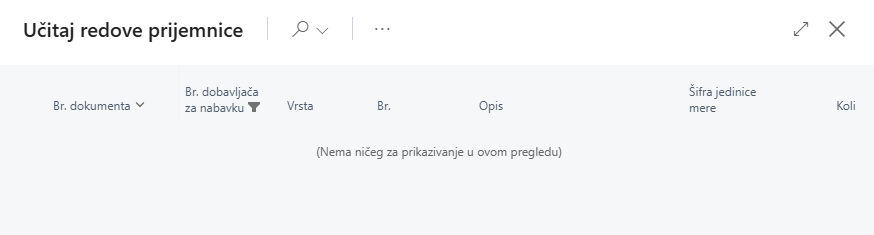

Potrebno je označiti sve one redove proknjiženih prijemnica nabavke za koje je potrebno knjižiti fakturu.

Potvrdom na dugme U redu, automatski se popunjavaju redovi na ulaznoj fakturi s referencama na broj proknjižene prijemnice nabavke. 

#### 2.4.5 Obrada podataka u redovima nabavne fakture  

Nakon učitavanja redova iz prijemnice, moguće je **naknadno urediti podatke**, kao što su:  
- **Količina**  
- **Popust na red**  

#### 2.4.6 Knjiženje nabavne fakture  

Nabavna faktura se knjiži akcijom **"Proknjiži"**.  

Knjiženjem nabavne fakture nastaje dokument **Proknjižena nabavna faktura**.  

Ako se na proknjiženoj fakturi klikne na **Idi do**, moguće je pregledati kreirane stavke, uključujući:  
- **Stavke glavne knjige (GK)**  
- **Stavke PDV-a**  
- **Stavke analitike dobavljača**  
- **Detaljne stavke analitike dobavljača**  
- **Stavke vrednosti**  

#### 2.4.7 Razlika između knjiženja direktno s porudžbine i knjiženja preko nabavne fakture  

Knjiženjem nabavne fakture ažuriraju se vrednosti u polju **Fakturisana količina** na redovima **Nabavne porudžbine**.  

Ključna razlika:  
- **Kod knjiženja direktno sa porudžbine** – ako su sve količine primljene i fakturisane, porudžbina se **briše automatski**.  
- **Kod knjiženja preko nabavne fakture** – čak i kada je cela količina primljena i fakturisana, **Nabavna porudžbina ostaje vidljiva**, omogućavajući dodatne provere i analize.  

### 2.5 Povrati u nabavci

#### 2.5.1 Proces povrata u nabavci  

Proces povrata u nabavci započinje kreiranjem **Naloga za povrat nabavljenog**.  

#### 2.5.2 Knjiženje isporuke povrata  

Knjiženjem isporuke povrata preko **Naloga za povrat nabavljenog** nastaje dokument:  
- **Proknjižena povratna isporuka nabavljenog**  

Ovim postupkom **smanjuje se količina artikla na zalihi**.  

#### 2.5.3 Knjiženje odobrenja  

Knjiženjem odobrenja nastaje dokument:  
- **Proknjiženo ulazno odobrenje**  

Nakon knjiženja, ažuriraju se sledeći podaci:  
- **Kartica dobavljača**  
- **Stanje artikla**  
- **Račun glavne knjige (GK)**  

#### 2.5.4 Nalog za povraćaj nabavljenog

**Kreiranje i knjiženje naloga za povrat nabavljenog**  

Ako je potrebno vratiti artikle dobavljaču ili otkazati nabavljene usluge, u programu **Microsoft Dynamics 365 Business Central** moguće je kreirati i proknjižiti **Nalog za povrat nabavljenog**.  

**Razlika između naloga za povrat i nabavnog odobrenja**  

- **Nabavno odobrenje** može se koristiti za jednostavniji povrat.  
- **Nalog za povrat nabavljenog** omogućava **veću kontrolu postupka povrata** i preporučuje se za složenije procese.  

Knjiženjem **Naloga za povrat nabavljenog** nastaju:  
- **Proknjiženo nabavno odobrenje**  
- **Proknjižena povratna isporuka**  

Nalog za povrat nabavljenog služi kao **interni dokument za kontrolu otpreme artikala dobavljačima**.  

**Knjiženje povrata sa istim troškom kao nabavka**  

Kako bi se osiguralo da se povrat dobavljaču knjiži **s istim troškom kao i nabavka**, koristi se funkcija:  
> **"Učitaj redove proknjiženog dokumenta za storniranje"**  

Ova funkcija omogućava **kopiranje redova** iz jednog ili više proknjiženih dokumenata dobavljača definisanog na zaglavlju, kako bi se isti podaci **stornirali**.  

**Opcije za učitavanje proknjiženih dokumenata**  

Klikom na akciju otvara se prozor s redovima proknjiženih dokumenata. Moguće opcije filtriranja:  
- **Proknjižene priznanice**  
- **Proknjižene fakture**  
- **Proknjižene otpremnice povrata**  
- **Proknjižena odobrenja**  

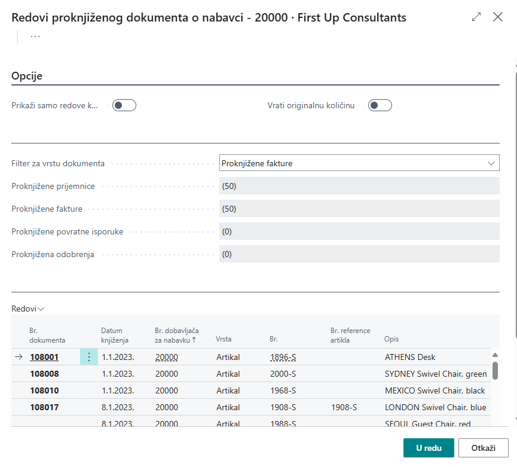

Potrebno je označiti sve one redove koje je potrebno stornirati, odnosno za koje će se napraviti povrat dobavljaču. Potvrdom će se popuniti redovi naloga za povrat kupljene robe s referencama na brojeve proknjiženih faktura i nabavnih prijemnica: 

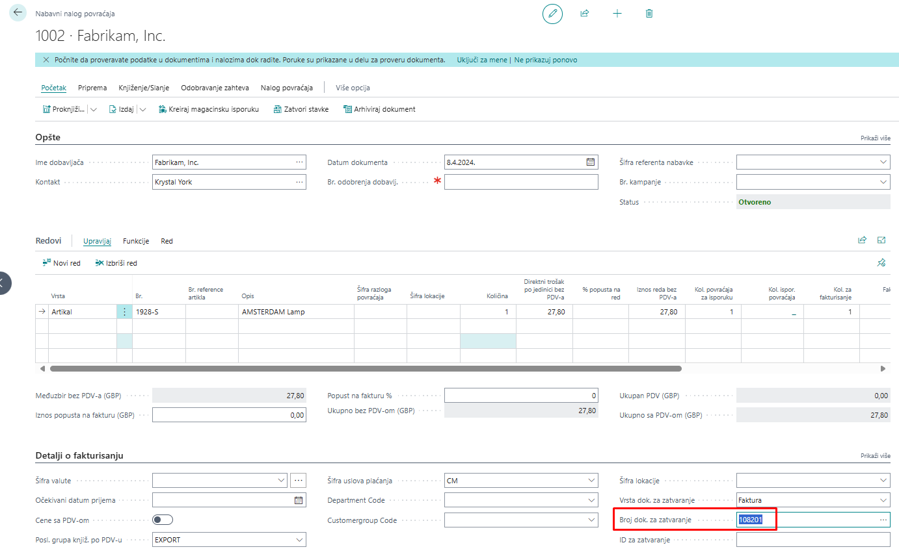

#### 2.5.5 Nabavno odobrenje

***Upotreba nabavnog odobrenja u procesu povrata***  

U procesu povrata u nabavci može se koristiti **Nabavno odobrenje**, koje se obično kreira kao reakcija na odobrenje koje pošalje dobavljač.  

**Nabavno odobrenje** služi kao:  
- **Interni dokument** za računovodstvene svrhe  
- **Kontrola otpreme artikala**  

***Delimičan povrat artikala***  

Nabavno odobrenje se može odnositi na:  
- **Sve artikle** sa originalne ulazne fakture  
- **Neke artikle** sa originalne ulazne fakture  

Kada se vrši delimičan povrat, potrebno je prilagoditi informacije u **ulaznom odobrenju** ili **nalogu za povrat kupljene robe**.  

***Kreiranje ulaznog odobrenja***  

Kako bi se uključile ispravne informacije sa ulazne fakture, postoji nekoliko opcija za kreiranje ulaznog odobrenja:  
- **Direktno iz proknjižene ulazne fakture**  
- **Novo ulazno odobrenje** s kopiranim informacijama iz proknjižene ulazne fakture  

***Kreiranje novog ulaznog odobrenja***  

Kreiranje novog ulaznog odobrenja direktno iz proknjižene ulazne fakture koja još nije plaćena moguće je klikom na akciju **"Storniraj"**. Ova akcija kreira i proknjižuje ulazno odobrenje koje će **stornirati proknjiženu ulaznu fakturu**.  

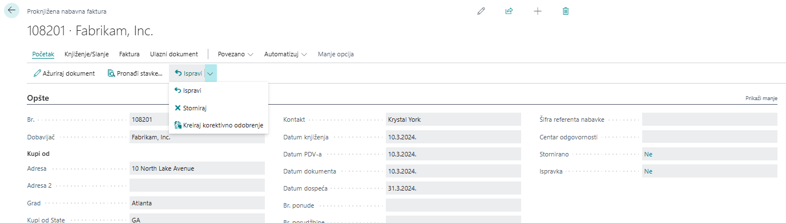

***Otkazivanje i ispravljanje ulaznih faktura***

Kao što je napomenuto, funkcije **Otkazi** i **Ispravi** (storniranje fakture i automatsko kreiranje nove ulazne fakture koju je moguće ispraviti pre knjiženja) mogu se koristiti samo za **neplaćene fakture**. Ove funkcije **ne podržavaju delimične povrate** ili storniranja.  

Ako je faktura već plaćena, potrebno je **ručno kreirati i knjižiti ulazno odobrenje**.  

***Ručno kreiranje novog ulaznog odobrenja***

Ručno kreiranje novog ulaznog odobrenja moguće je klikom na **Novo** na listi ulaznih odobrenja.  
- Potrebno je popuniti podatke na **zaglavlju**.
- **Redove** možete popuniti:
  - **Ručno** ili
  - Koristeći neku od dostupnih funkcija

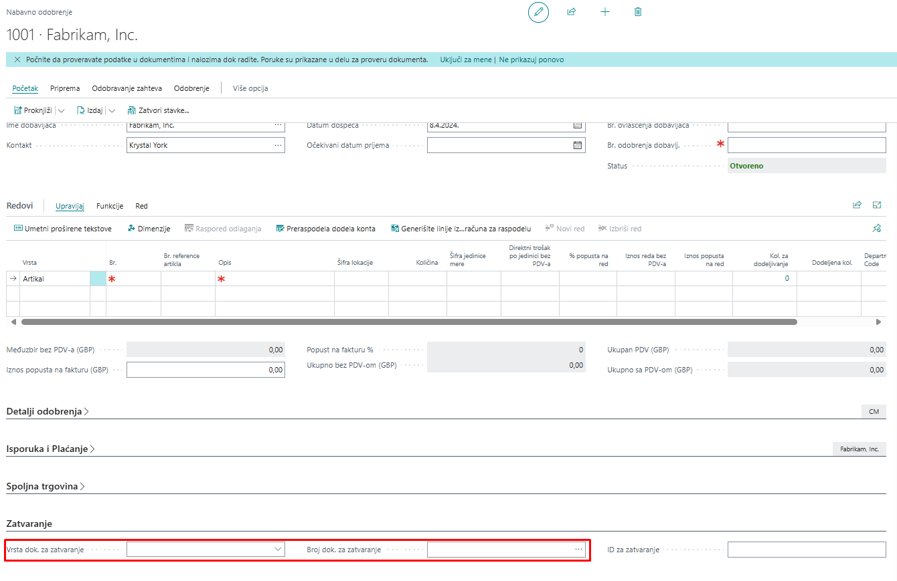

## 3. Nabavne cene

Postavljanje nabavnih cena u Microsoft Dynamics 365 Business Central

U programu **Microsoft Dynamics 365 Business Central** moguće je postaviti **nabavne cene**. Nabavne cene predstavljaju alternativne cene artikala za kombinaciju broja artikla i dobavljača, uz sledeće kriterijume:  
- **Šifra varijante** (varijanta u kojoj se nabavlja artikl)  
- **Šifra JM** (jedinica mere u kojoj se nabavlja artikl)  
- **Najmanja količina**  
- **Početni datum** (od kojeg vredi nabavna cena)  
- **Krajnji datum** (do kojeg vredi nabavna cena)  
- **Šifra valute**  

Nabavna cena definiše se u polju **Direktni trošak po jedinici**.

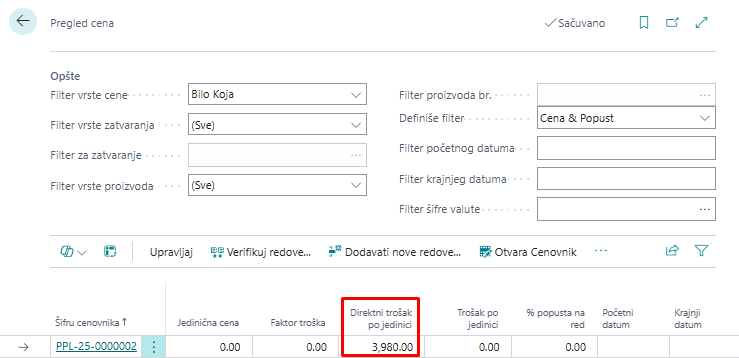

### 3.1 Unos nabavnih cena

Nabavne cene mogu se uneti sa liste artikala za označeni artikl ili sa kartice artikla. Potrebno je kliknuti na traci akcija na Cene i popusti -> Nabavne cene.

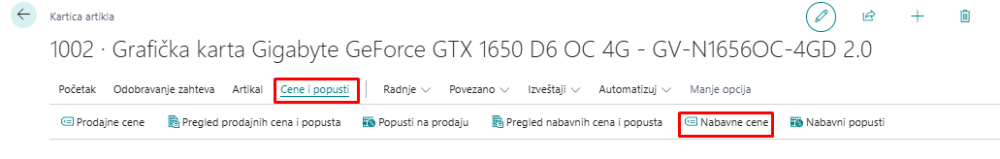

Nabavne cene moguće je postaviti i preko kartice dobavljača (Cene i popusti -> Cene): 

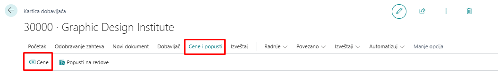

***Postavljanje nabavnih cena za dobavljače***

Nabavne cene se **uvek postavljaju za svakog dobavljača posebno**, dok se **prodajne cene** mogu definisati za kupca, grupu kupaca ili sve kupce.  

Polazna tačka za postavku nabavnih cena je **Poslednji direktni trošak** na kartici artikla.  
- Trošak sa kartice artikla uzima se kao relevantan za nabavku ako:  
  - Ne postoji postavljena nabavna cena za tog dobavljača, ili  
  - Ako postoji nabavna cena, ali kriterijumi za korišćenje postavljene nabavne cene nisu ispunjeni.

### 3.2 Upotreba nabavnih cena

Ako za dobavljača postoji više postavljenih nabavnih cena, program **Microsoft Dynamics 365 Business Central** uvek uzima **najbolju cenu** koja zadovoljava uslove upisane u redu nabavne cene i koristi je na nabavnom dokumentu kao relevantnu.  

Nakon unosa artikla u red nabavnog dokumenta za dobavljača koji ima postavljenu nabavnu cenu, moguće je proveriti sve nabavne cene na činjeničnom okviru u delu **Detalji reda nabavke**.

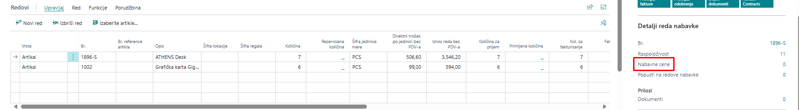

Kada je vrednost polja "nabavna cena" jednak 1 ili više, možemo klikom na taj broj otvoriti prozor sa poljima Br. dobavljača, Br. artikla, Direktan trošak po jedinici, tako da na ovaj način referent nabavke može da proveri sve nabavne cene za dobavljača, može sačekati nekoliko dana ako primeti da će tada cena biti niža, ili može nabaviti veću količinu ako je za bolju nabavnu cenu definisana minimalna količina koju je potrebno nabaviti da bi vredela niža cena. 

### 3.3 Popusti u nabavci

#### 3.3.1 Postavljanje popusta u nabavci u Microsoft Dynamics 365 Business Central

Popusti u nabavci mogu se postaviti na sličan način kao nabavne cene. Da bi se popusti primenili kod nabavke artikla od dobavljača, moraju biti zadovoljeni određeni uslovi i pravila. Dve vrste popusta u nabavci su:

- **Popusti na red**
- **Popusti na fakturu**

Kao kod nabavnih cena, program uzima **najbolji popust** za dobavljača, ukoliko su zadovoljeni potrebni uslovi definisani za popuste.

#### 3.3.2 Popusti na red

Popust na red biće upisan u redove nabavke ako postoji određena kombinacija dobavljača, artikla, minimalne količine, jedinice mere ili početnog/krajnjeg datuma.

#### 3.3.3 Podešavanje popusta na red

Podešavanje popusta na red je vrlo slično podešavanju nabavnih cena. Može se postaviti preko kartice artikla, klikom na **Cene i popusti -> Pregled nabavnih cena i popusta/Nabavni popusti**.

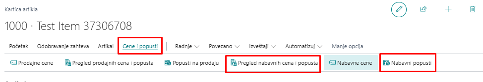

Takođe, na kartici "Dobavljači", klikom na *Cene i popusti* -> Popusti na redove

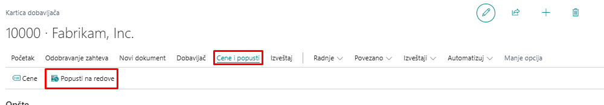

Klikom na akciju Popusti na redove otvara se prozor na kojem je za kombinaciju dobavljača i artikla moguće uneti popust na red nabavke u polje % popusta na red s dodatnim uslovima poput minimalne količine, jedinice mere ili početnog / krajnjeg datuma.  

***Upotreba popusta na red***

Kada su popusti na red postavljeni, sistem ih automatski primenjuje ako su ispunjeni uslovi, pri čemu se koristi najveći dostupni popust. Nakon unosa artikla u nabavku, popuste je moguće proveriti u činjeničnom okviru.

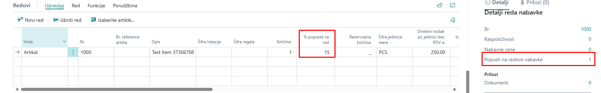

Na slici iznad vidljivo je da za ovu kombinaciju artikla i dobavljača postoji definisan 1 popusta na red nabavke. Klikom na vrednost 1, otvara se prozor s detaljnim prikazom popusta na red nabavke: 

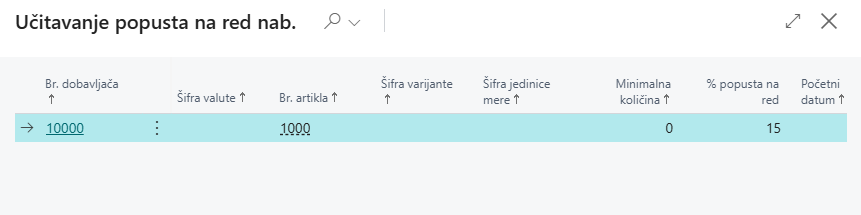

#### 3.3.4 Popusti na fakturu

Druga vrsta popusta u nabavci je popust na fakturu. Kod popusta na fakturu procenat popusta oduzima se od ukupnog iznosa dokumenta, ako ukupan iznos svih redova na nabavnom dokumentu prelazi određeni minimum.  

***Podešavanje popusta na fakturu***

Popust na fakturu moguće je postaviti s kartice dobavljača (Povezano -> Nabavka -> Popusti na fakturu) i primenjuje se na fakture za dobavljača: 

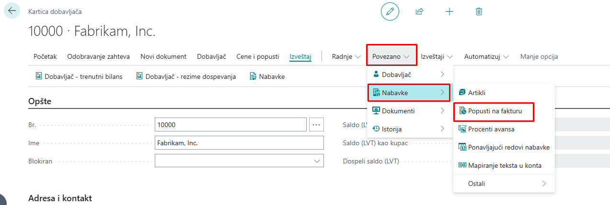

Klikom na akciju "Popusti na fakture" otvara se prozor gde se definišu procenti popusta na fakture za dobavljače. Popust na fakturu upisuje se u polje % popusta: 

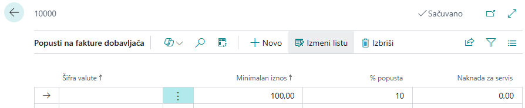

Prilikom kreiranja novog dobavljača, polje „Šifra popusta na fakturu“ na brzoj kartici "Fakturisanje", automatski se popunjava brojem dobavljača. Ovo omogućava brzo dodeljivanje postojećeg popusta izborom šifre drugog dobavljača sa istim uslovima.

***Upotreba popusta na fakturu***

Dodavanjem artikala u nabavni dokument povećava se ukupan iznos fakture. Ako je opcija "Proračun popusta na fakturu" uključena u podešavanjima, sistem će automatski obračunati popust kada iznos dokumenta pređe definisani prag.

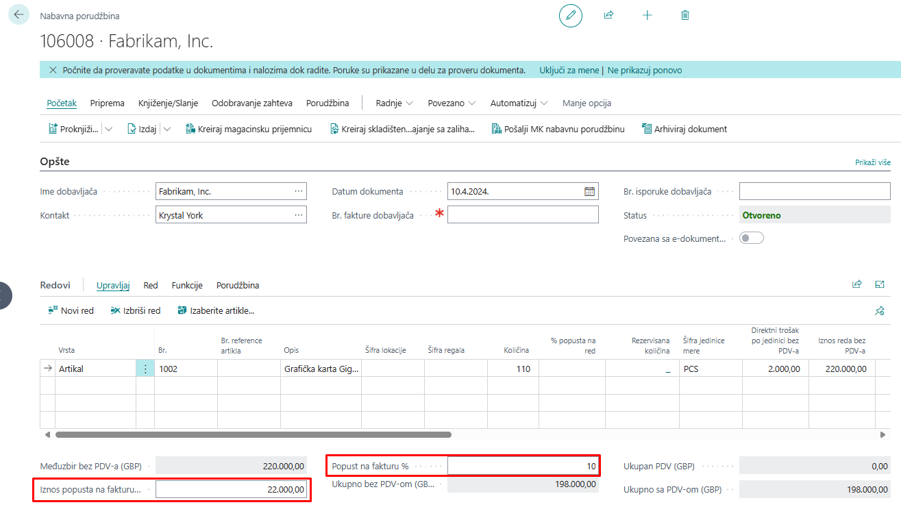

## 4. Troškovi artikla u nabavci 

Troškovi povezani s artiklima obuhvataju špediciju, carinu, transport, ambalažu, kao i troškove utovara i istovara robe, zajedno s ostalim relevantnim izdacima. Ovi troškovi mogu biti prisutni ne samo na nabavnim dokumentima, već i na prodajnim, gde doprinose preciznijem obračunu direktnog troška artikla.

### 4.1 Podešavanje troška artikla

Kada su troškovi povezani s nabavkom artikala, potrebno ih je uključiti u vrednovanje zaliha i obračun troškova prodate robe. Moguće je definisati različite vrste troškova artikala kako bi se preciznije razlikovali troškovni elementi, što poboljšava analizu troškova i statistiku prodaje.

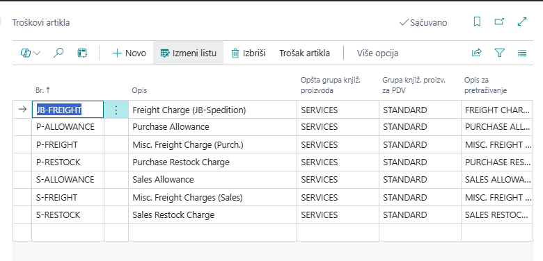

Poput artikla, trošak artikla takođe mora imati Opštu knjižnu grupu proizvoda i Grupa knjiženja proizvoda za PDV. Njihova kombinacija određuje račun glavne knjige na koji se knjiži trošak artikla. Nakon što se postave troškovi artikla, mogu se koristiti na redovima nabavnih i prodajnih dokumenata. 

### 4.2 Dodela troška artikla

Trošak artikla može se dodeliti na dva načina:  

&nbsp;&nbsp;- **Na nabavnom dokumentu** koji sadrži artikle na koje se odnose troškovi. Ovaj način se obično koristi na dokumentima koji još nisu proknjiženi.  
&nbsp;&nbsp;- **Na odvojenoj fakturi**, gde se trošak artikla povezuje s proknjiženom nabavnom priznanicom koja sadrži relevantne artikle.  

Kada se trošak artikla dodeljuje direktno na nabavnom dokumentu, potrebno je dodati novi red i kao **Vrstu** izabrati **Trošak (artikal)**. Za ovaj red treba uneti vrednosti u polja **Količina** i **Direktni jedinični trošak**. Nakon toga, potrebno je selektovati red s troškom i izabrati opciju **Red -> Dodela troška artikla**.

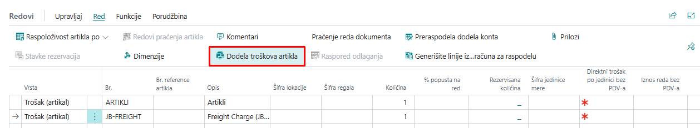

Klikom na "Dodela troška artikla", otvara se prozor za raspodelu troškova artikala na kojoj su prikazani redovi narudžbenice s artiklima. Business Central nudi raspodelu troškova artikala na redove narudžbenice funkcijom "Predloži" dodelu troška artikla… (preko dugmeta Trošak artikla): 

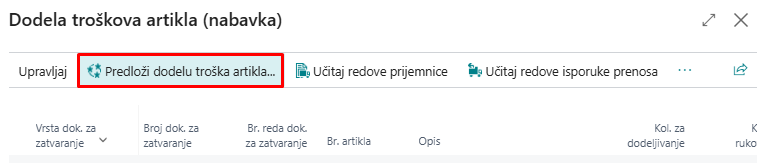

Klikom na funkciju "Predloži dodelu troška artikla…" otvara se prozor s opcijama raspodele troška: 

&nbsp;&nbsp;- Jednako – trošak artikla dodeljen je jednako na sve redove na prozoru Dodela troška artikla. 
&nbsp;&nbsp;- Po iznosu – trošak artikla dodeljen je i izračunat prema iznosu svakog reda. 
&nbsp;&nbsp;- Po težini – trošak artikla dodeljen je prema zbiru težina artikala definisanih na kartici svakog artikla. 
&nbsp;&nbsp;- Po volumenu – trošak artikla dodeljen je prema zbiru volumena artikala definisanih na kartici svakog artikla. 

 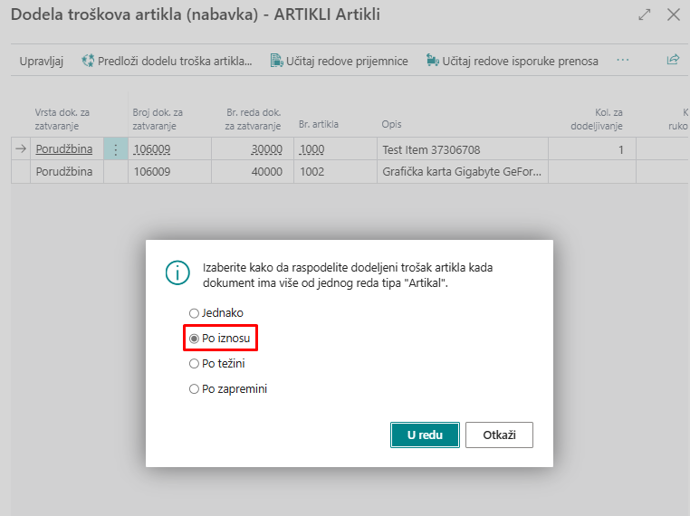

Odabirom jedne od opcija, na primer "Po iznosu", sistem će na redovima popuniti polja *"Kol. za dodelu"* i *"Iznos za dodelu"*. 

Moguće je i ručno izmeniti *"Kol. za dodelu"*, čime će se ažurirati polje *"Iznos za dodelu"*. 

Nakon zatvaranja stranice za raspodelu troškova artikla, troškovi se automatski dodeljuju redovima narudžbenice, omogućavajući knjiženje nabavne porudžbine. Kada se dokument proknjiži, u analitičkim stavkama artikla pojaviće se novi unos, gde će polje "Iznos troška" (stvarni) sadržavati i dodeljeni trošak artikla. Ovaj trošak biće vidljiv na stavkama vrednosti, gde će se pored postojeće stavke direktnog troška nabavke generisati dodatna stavka direktnog troška, ali specifično vezana za trošak artikla.

Trošak artikla može se dodeliti i putem zasebne ***fakture***. U ovom slučaju, na ulaznoj fakturi dodaje se samo red vrste Trošak (artikal), bez artikala iz nabavne porudžbine. Ovaj pristup se često koristi kada troškove, poput transporta i špedicije, fakturiše treća strana, npr. špediter. Kao i kod dodele troška na nabavnoj porudžbini, potrebno je uneti *Količinu* i *Direktni jedinični trošak*.

Ako se ovako kreirana ulazna faktura pokuša proknjižiti bez prethodne dodele troška artikla, sistem će prikazati grešku. Da bi se trošak pravilno dodelio, potrebno je selektovati red s troškom, zatim iz menija odabrati Red -> Povezane informacije-> ***"Dodela troška artikla"***. 

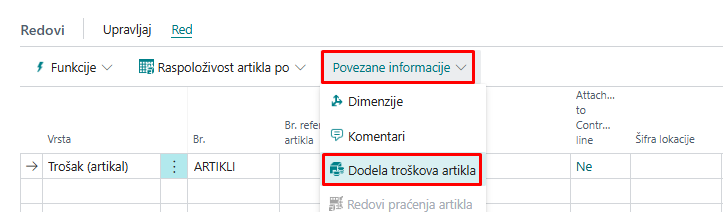

Kada se otvori prozor biramo opciju ***"Učitaj redove prijemnice"***

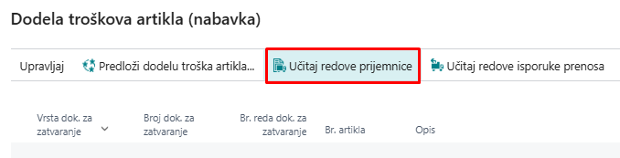

Otvoriće se redovi priznanice nabavke. Potrebno je označiti sve redove za koje se želi vezati trošak artikla i kliknuti *U redu*. 

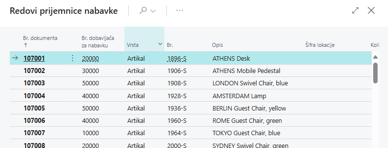

Nakon potvrde, na stranici za dodelu troška artikla prikazaće se samo prethodno označeni redovi. Kao i u ranijem primeru, potrebno je kliknuti na opciju Predloži dodelu troška artikla, odabrati jednu od ponuđenih metoda raspodele i potvrditi klikom na U redu. Time će se trošak ravnomerno raspodeliti po odgovarajućim redovima dokumenta.

Pored opcije *"Učitaj redove prijemnice"*, putem dugmeta *Akcije*, moguće je koristiti i sledeće funkcije za učitavanje redova iz različitih tipova dokumenata:

&nbsp;&nbsp;- Učitaj redove prijemnice prenosa
&nbsp;&nbsp;- Učitaj redove isporuke povrata
&nbsp;&nbsp;- Učitaj redove izlazne isporuke
&nbsp;&nbsp;- Učitaj redove prijemnice povrata
  
Princip rada za ove funkcije je isti kao kod učitavanja redova prijemnice nabavke – korisnik označava željene redove i potvrđuje izbor klikom na *U redu*. Nakon toga, označeni redovi će se prikazati na stranici za dodelu troška artikla.

Poslednji korak je dodela troškova artiklima u učitanim redovima i zatvaranje stranice. Kada je trošak uspešno dodeljen, sistem će omogućiti knjiženje ulazne fakture, jer su svi troškovi artikala pravilno raspoređeni.

